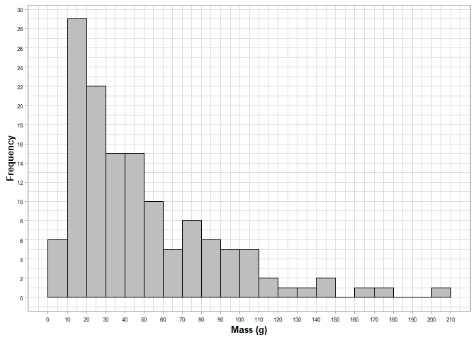

# **Scraper original mass: a different approach and its wide range implementation**

Guillermo Bustos-Pérez $^{(1,2,3)}$

$^{(1)}$ Department of Human Origins, Max Planck Institute for
Evolutionary Anthropology, Leipzig.  
$^{(2)}$ Institut Català de Paleoecologia Humana i Evolució Social
(IPHES-CERCA), Tarragona, Spain.  
$^{(3)}$ Departament d’Història i Història de l’Art, Universitat Rovira
i Virgili, Tarragona, Spain.

<div align="justify">

## **Abstract**

Predicting the original mass of a retouched scraper has long been a
major goal in lithic analysis. It is commonly linked to lithic
technological organization of past societies along with notions of stone
tool general morphology, standardization through the reduction process,
use life, and site occupation patterns. In order to obtain a prediction
of original stone tool mass, previous studies have focused on attributes
that would remain constant or unaltered through retouch episodes.
However, these approaches have provided limited success for predictions
and have also remained untested in the framework of successive
resharpening episodes. In the research presented here, a set of
experimentally knapped flint flakes were successively resharpened as
scraper types. After each resharpening episode, four attributes were
recorded (scraper mass, height of retouch, maximum thickness and the
GIUR index). Four machine learning models were trained using these
variables in order to estimate the mass of the flake prior to any
retouch. A Random Forest model provided the best results with an r2
value of 0.97 when predicting original flake mass, and a r2 value of
0.84 when predicting percentage of mass lost by retouch. The Random
Forest model has been integrated into an open source and free to use
Shiny app. This allows for the wide spread implementation of a highly
precise machine learning model for predicting initial mass of flake
blanks successively retouched into scrapers.

**Key words:** experimental archaeology; lithic reduction; flake mass;
machine learning.

## **Introduction**

Scrapers are some of the most common lithic implements among
archaeological lithic assemblages. They are present from the first
Oldowan stone tools
\[[1](#ref-barsky_early_2011)–[3](#ref-semaw_26-million-year-old_2003)\]
through to modern ethnographic studies of hunter gatherers
\[[4](#ref-casamiquela_temas_1978)–[7](#ref-sillitoe_living_2003)\]. The
“reduction model”
\[[8](#ref-dibble_middle_1995),[9](#ref-dibble_interpretation_1987)\]
suggests that some stone tools (including scrapers) can represent
different stages of reuse and modification through retouch. When
considering scrapers within the reduction model, an integral concept is
that of curation. The initial definition of curation included a series
of behavioral patterns related to provisioning strategies
\[[10](#ref-binford_organization_1979),[11](#ref-renfrew_interassemblage_1973)\].
However, further authors included into curation behavioral strategies
such as tool transport, utilization in a wide range of tasks,
anticipated production, hafting, and recycling (after the original tool
had been discarded). An alternative definition of curation was proposed
by Shott
\[[12](#ref-shott_exegesis_1996),[13](#ref-shott_tool-class_1989)\], who
defined curation as “the ratio of realized to potential utility”. This
new approach to the definition of curation has important implications
for lithic analysis and the study of lithic technological organization
since it transforms curation into a continuous variable
\[[12](#ref-shott_exegesis_1996)\]. Given this new definition, and in
the framework of the reduction model, the amount of mass lost by a
lithic artifact by reuse/resharpening will be equivalent to its ratio of
curation. Both variables (amount in grams and percentage of mass lost by
a stone tool) can be empirically calculated in experimental contexts and
estimated in archaeological contexts. The presence of scrapers and their
curation relates to several aspects of the organization of lithic
technology of past societies
\[[14](#ref-clarkson_holocene_2002)–[19](#ref-shott_use_2017)\]. Amount
of curation affects the shape of stone tools at the moment of their
discard (thus affecting the morphological variability of stone tool
assemblages observed through time). Amount of curation can also relate
to raw material sources, with more curated artifacts coming from longer
distances. Curation also relates to the selection of technological
products for more intensive retouch, or shifts in technological
strategies of transport, thus informing about the cultural choices and
patterns of past human groups. Finally, curation also relates to tool
use and use-wear analysis.

Because of these reasons, predicting original scraper mass is a major
goal in lithic analysis. Thus far, two approaches are employed to
estimate the reduction and curation undergone by a retouched artifact.
The first approach uses estimations derived from direct measurements on
retouch. This has led to the proposal of several indexes using different
measurements, such as height of retouch, length of retouched edge or
projection of the original angle
\[[20](#ref-bustos-perez_exploring_2019)–[23](#ref-morales_measuring_2015)\].
These indices usually provide good correlation values with mass lost,
but they are usually conditioned by flake morphology, direction of
retouch, or tool type (laterally retouched scrapers, endscrapers,
bifacial products, etc.) and each one uses different scale ranges.

The second approach aims at estimating original flake mass based on
remaining flake features. This approach has the advantage of not being
limited by tool type, direction of retouch or flake morphology. Initial
work focused on controlled experiments of flake formation using
different measures of flake platform (width, depth) and exterior
platform angle (EPA) to estimate flake mass
\[[24](#ref-dibble_platform_1997)–[28](#ref-pelcin_controlled_1996)\].
Some of the reasons to select these features were that they usually
remain unaltered in most retouched artefacts. These controlled
experiments provided strong explanatory power for the formation of
flakes, with flake mass being predicted with an r2 value above 0.8
\[[25](#ref-dibble_effect_1995),[29](#ref-li_synthesis_2023)\]. However,
when the same variables are used to predict mass of experimentally
knapped flakes, the predictive power of the model diminishes
significantly, with r2 values dropping to 0.403
\[[30](#ref-davis_quantifying_1998)\] (0.224 for the same retouched
flakes), and 0.384 \[[31](#ref-shott_flake_2000)\]. These results meant
an important drawback since, as Dibble
\[[32](#ref-dibble_comment_1998)\] states: “controlled experiments, in
spite of their elegance, objectivity and replicability, are only useful
if the results obtained from them are directly applicable to
archaeological materials”.

To overcome the limitations from these results, three approaches are
commonly undertaken:

1)  Adding additional features as predictive variables. Commonly flake
    thickness is added
    \[[19](#ref-shott_use_2017),[33](#ref-dogandzic_edge_2015)\], since
    it is widely considered to remain unaltered through the reduction
    process. Other variables, such as scar count or remaining amount of
    cortex, seem to improve the predictive power of models
    \[[34](#ref-bustos-perez_predicting_2021),[35](#ref-bustos-perez_multiple_2022)\].  
2)  Applying new methods for measuring more accurately existing
    variables. Examples are the refinement on traditional manual
    measurements of platform \[[36](#ref-muller_new_2016)\], the use of
    digital photographs \[[37](#ref-braun_landscape-scale_2008)\], or 3D
    scans for measuring platform
    \[[38](#ref-clarkson_estimating_2011),[39](#ref-maloney_experimental_2020)\].  
3)  Applying different families of transformations in order to favor the
    Gaussian distribution of values of predictors and flake mass, thus
    increasing the predictive power of most models. These
    transformations usually use the cubic root
    \[[29](#ref-li_synthesis_2023),[33](#ref-dogandzic_edge_2015),[40](#ref-dogandzic_results_2020)\]
    or different logarithmic transformations
    \[[30](#ref-davis_quantifying_1998),[31](#ref-shott_flake_2000),[34](#ref-bustos-perez_predicting_2021),[35](#ref-bustos-perez_multiple_2022),[38](#ref-clarkson_estimating_2011),[39](#ref-maloney_experimental_2020)\].

It can be considered that these additions and improvements have provided
correlation values of original flake mass on scrapers which allow for
comparisons at the assemblage level. However, estimations at the
individual stone artifact level remain unsatisfactory with a limited
application to archaeological cases. This is due to three main reasons.
First, while most research explores extensively the prediction of mass
through different variables (and their interactions), it is usually not
considered in the frame of continuous resharpening process, and when it
is tested in this framework (continuous or single episodes of retouch),
results provide lower correlation values
\[[32](#ref-dibble_comment_1998),[39](#ref-maloney_experimental_2020)\].
Second, while most research aims at estimating original flake mass, less
research provides results of estimations of percentage of mass lost
against actual percentage of mass lost during retouch, which is the key
component of the curated concept
\[[6](#ref-shott_measuring_2007),[12](#ref-shott_exegesis_1996)\].
Third, most archaeological research addressing the prediction of
original flake/scraper mass result in equations which might be difficult
to extrapolate and practically apply other archaeological assemblages
\[[19](#ref-shott_use_2017),[30](#ref-davis_quantifying_1998),[41](#ref-morales_distribution_2016)\].
Recently
\[[34](#ref-bustos-perez_predicting_2021),[35](#ref-bustos-perez_multiple_2022)\],
the use of machine learning has allowed the implementation of feature
selection (identification of how many and which variables are better for
prediction) and new algorithms. However, it has also resulted in limited
improvements of the correlation coefficient
\[[35](#ref-bustos-perez_multiple_2022)\], indicating that a possible
threshold limit for this approach is being reached.

A new framework is needed to overcome the limitations of previous models
(absence of being tested in sequential experimentations, higher
accuracy, and easy implementation for all lithic analysts) aimed at
predicting original flake mass from scraper attributes and being able to
reach the individual scraper level. In the present study 134 flakes were
successively retouched, providing a dataset of 694 episodes of
resharpening. After each retouch episode, a series of attributes were
measured and used to train four machine learning models. A Random Forest
model provided the highest r2 value (0.974) when estimating scraper
original mass, and the highest r2 (0.839) when estimating percentage of
mass lost by retouch. The Random Forest model and all training data are
implemented through a Shiny app “Original Scraper Mass Calculator
v.1.0”, which allows the user to manually introduce the data from a
scraper to estimate its original mass or to upload all data at once and
download the results.

## **Materials and methods.**

### **Experimental sample.**

The analyzed sample consisted of 134 experimentally knapped flakes using
hard hammer. The raw material of hammerstones varied widely (quartz,
quartzite, sandstone, and limestone), which allowed for a diverse range
of morphologies and potential active percussion areas. The experimental
sample is dominated by flakes with feather terminations (n = 121;
90.3%), followed by flakes with hinge terminations (n = 10; 7.46%).

``` r
Data1 <- read.csv("Data/Data1.csv", sep = " ")
load("Data/Data2.RData")
library(tidyverse); library(caret)
```

Initial flake mass was recorded using a Sytech SY-BS502 with a precision
of 0.01 grams. Average weight of the samples was 47.38 g, with 50% of
flakes weighing between 18.07 and 63.16 g, and a standard deviation of
36.48. Figure 1 presents the flake mass distribution for the
experimental sample, indicating a long tail of 14 flakes weighing more
than 100 g.

The transversal section of flakes is considered to have an important
effect on estimations derived from the geometric index of unifacial
reduction (GIUR) \[[22](#ref-kuhn_geometric_1990)\] and height of
retouch. In particular, when a flake’s dorsal surface is parallel to the
ventral surface, the GIUR and height of retouch will only marginally or
will not at all increase after each resharpening episode, resulting in
underestimations of flake mass removal
\[[8](#ref-dibble_middle_1995),[42](#ref-eren_kuhns_2009)\]. However,
the actual effect of the “flat flake problem” on the estimation of flake
mass might be marginal
\[[43](#ref-hiscock_reality_2009),[44](#ref-hiscock_experimental_2005)\].
The present study recorded flake schematic transversal section prior to
retouch of each flake, with possible categories being: circular (n =
20), triangular (n = 63), triangular asymmetric (n = 29), trapezoidal (n
= 13) and trapezoidal asymmetric (n = 9). The first three categories are
considered to represent cases where the “flat flake problem” is not
present, while the latter two are consider to represent cases were this
problem is present.

``` r
Data0 <- read.csv("Data/Data0.csv", sep = ",")

Summary_Assem <- data.frame(
  rbind(data.frame(data.matrix(summary(Data0$L.mm))) %>% t(),
        data.frame(data.matrix(summary(Data0$W.mm))) %>% t(),
        data.frame(data.matrix(summary(Data0$T.mm))) %>% t(),
        data.frame(data.matrix(summary(Data0$Max.Thick.mm))) %>% t(),
        data.frame(data.matrix(summary(Data0$Mean.Edge.Angle.Selected.ret))) %>% t()))
Measure <- c("Length", "Width", "Middle Thickness", "Maximum thick",
             "Mean angle edge prior to retouch")
Summary_Assem <- cbind(Measure, Summary_Assem)
rownames(Summary_Assem) <- 1:nrow(Summary_Assem)
print(Summary_Assem)
```

    ##                            Measure Min. X1st.Qu. Median     Mean X3rd.Qu.
    ## 1                           Length 24.5  50.9500 62.600 63.23060   75.800
    ## 2                            Width 17.4  40.7000 47.250 49.94552   58.250
    ## 3                 Middle Thickness  4.2   9.8250 13.400 14.46194   18.625
    ## 4                    Maximum thick  6.0  12.0250 15.800 16.57313   20.000
    ## 5 Mean angle edge prior to retouch 13.5  33.0825 39.835 41.27119   48.670
    ##     Max.
    ## 1 106.70
    ## 2  90.40
    ## 3  34.70
    ## 4  36.00
    ## 5  72.33

``` r
rm(Data0)
```

``` r
Data1 %>% 
  filter(Episode == 0) %>% 
  ggplot(aes(Or.Weight.g)) +
  geom_histogram(binwidth = 10,
                 color = "black", fill = "gray", 
                 boundary = 0) +
  theme_light() +
  ylab("Frequency") +
  xlab("Mass (g)") +
  scale_x_continuous(breaks = seq(0, 210, 10)) +
  scale_y_continuous(breaks = seq(0, 30, 2)) +
  theme(
    axis.text = element_text(color = "black", size = 6),
    axis.title = element_text(color = "black", size = 10, face = "bold"))
```

<!-- -->  

All flakes were retouched until they were too small to hold while
retouching (n = 4), they broke during retouch (n = 74), or the angle of
retouch was too abrupt to detach additional resharpening flakes (n =
59). Retouch was done through freehand direct hard hammer on the dorsal
face of flakes (direct retouch). In order to reshape the flakes one
continuous retouched edge was established. After the first episode of
resharpening, the retouched edge was expanded through the flakes edge in
a continuous manner. This limits the potential application of this index
to simple scrapers with direct retouch (which excludes double scrapers
or scrapers with inverse or bifacial retouch).

Most flakes underwent between four and seven episodes of retouch
(67.2%), while only seven flakes provided nine or more episodes of
retouch. The experimental assemblage provided a total of 694
resharpening episodes with which to train the predictive models.

### **Feature selection.**

Based on previous research
\[[22](#ref-kuhn_geometric_1990),[33](#ref-dogandzic_edge_2015),[34](#ref-bustos-perez_predicting_2021),[44](#ref-hiscock_experimental_2005)\]
variables were recorded as predictive features. After each episode of
retouch, the following variables were recorded:

- Remaining scraper mass, recorded in grams with a Sytech SY-BS502 scale
  and a precision of 0.01 g. This variable is selected since machine
  learning models will consider remaining flake mass as a baseline on
  minimum mass of the scraper.  
- Thickness at the midpoint of the flake (measured in mm with a
  precision of 0.1). It is considered that thickness remains relatively
  unchanged as resharpening increases \[[19](#ref-shott_use_2017)\], and
  its addition tends to increase the predictive power of models
  \[[33](#ref-dogandzic_edge_2015)\].  
- Maximum thickness of the flake measured in mm (with a precision of
  0.1). Feature selection through all possible combination of variables
  indicates that the logarithmic (base 10) transformation of this
  variable can increase the predictive power of regression models for
  freehand knapped flakes. Logarithmic transformation can result in
  Gaussian distribution of feature values increasing the predictive
  power of a model \[[34](#ref-bustos-perez_predicting_2021)\]. It is
  also considered that as resharpening proceeds, the thickness at the
  midpoint will be displaced (since length and width will diminish),
  while maximum thickness will remain more stable.  
- Three equidistant measures of height of retouch (*t*) and the
  corresponding thickness (*T*) of the flake
  \[[44](#ref-hiscock_experimental_2005)\] measured in mm (with a
  precision of 0.1). The average of these three points is used as a
  predictive feature. Here it is considered that the average height of
  the retouch will serve as a proxy of mass removed from the scrapper.  
- The GIUR index proposed by Kuhn \[[22](#ref-kuhn_geometric_1990)\].
  This index divides the height of retouch (*t*) by its corresponding
  thickness (*T*). As previously indicated, the present study records
  three equidistant heights of retouch (*t*), each being divided by
  their corresponding flake thickness (*T*). The GIUR value is
  calculated as the average of these three divisions. GIUR values can
  range from 0 (unretouched flake) to 1 (when the height of the reaches
  the dorsal side of a flake).  
  Variables selected for training the regression models were: scraper
  mass, maximum thickness (log transformed), average height of
  retouch (t) and value of the GIUR index.

### **Regression models and evaluation.**

Four methods were employed for regression analysis: multiple linear
regression, support vector regression with a linear kernel, random
forest and gradient boosting machine.

Multiple linear regression (MLR) extends the simple linear regression in
such a way that it can directly accommodate multiple predictors
\[[45](#ref-james_introduction_2013) : 71\].

Support vector machines for regression
\[[46](#ref-awad_support_2015)–[48](#ref-smola_tutorial_2004)\] with a
linear kernel (SVML) fit a linear hyperplane and a margin of error which
allows for errors of points falling inside the margin. Points falling
outside the margin define the support vectors. This provides a model
focused on the general trend which aims to maximize the margin while
minimizing the error, and which is also robust to the presence of
outliers.

Random forest for regression selects random samples of the data and
builds decision trees for prediction \[[49](#ref-breiman_random_2001)\].
As a result, each tree is built from different combinations of the data,
and the average is used as prediction. This adds diversity, reduces
overfit, and provides high-accuracy predictions
\[[50](#ref-lantz_machine_2019)\].

The gradient boosting machine (GBM) is an ensemble method that builds up
a final model by incrementally improving an existing one
\[[51](#ref-friedman_greedy_2001),[52](#ref-friedman_stochastic_2002)\].
The first model uses an initial *“shallow tree”* with a constant value
(average of the labels). Following this initial model, a new tree (*weak
learner*) is fitted to predict the residuals of the model, contributing
to the final model predictions, allowing for correction of the errors of
the model. This process is repeated, allowing it to progressively
identify the shortcomings of week learners on a sequence of decision
trees and to reduce the errors of the ensemble predictions.

Initial models are trained to estimate original scraper mass based on
the set of selected attributes. However, as previously stated, the
objective is to evaluate the ability of a model to predict the curation
ratio of a stone tool (percentage of mass remaining relative to its
original mass). Calculating the curation ratio of a stone tool can be
formulated as:

$$ 100 - ((M/EOM) * 100) $$ Where:  
M = mass (directly measured on the scraper).  
EOM = estimated original mass (provided by the model).

Models of both predictions (original scraper mass and curation ratio)
are compared using four measures of performance: $r^2$, MAE, RMSE, and
MAPE. $r^2$ is a measure of linear correlation and of how much of the
observed variation is explained by the model
\[[45](#ref-james_introduction_2013)\]. In lithic studies, a
categorization of the predictive power of indices has been proposed
based on their $r^2$ values, where \<0.1 is low, 0.1–0.25 is moderate,
0.26–0.5 is fairly large/strong, 0.51–0.8 is very large/strong and \>0.8
is extremely large/strong. However, it is important to consider that
different distributions of data can result in same or similar $r^2$
values \[[53](#ref-anscombe_graphs_1973)\].

Mean average error (MAE), root mean squared error (RMSE), and mean
average percentual error (MAPE) provide summary values of how far
predictions fall from the true value
\[[45](#ref-james_introduction_2013),[50](#ref-lantz_machine_2019)\].
MAE measures the average magnitude of errors, regardless of signal. RMSE
also provides a measure of distance between predicted and actual values,
although it punishes large errors. RMSE is usually compared to the
standard deviation (SD) of the variable to be predicted. If RMSE
presents a lower value than the SD, this is indicative of a good model
which predicts values better than taking the average value of the
sample. MAPE provides a measure of distance on a proportional basis (a
residual of 3 g in a 12 g flake will be much higher than in a 50 g
flake). A perfect model has a MAE, RMSE, and MAPE values of 0, and in
general, better models will have lower values of MAE, RMSE, and MAPE.

Collinearity of the predictors is addressed through the variance
inflation factor (VIF). VIF provides a measure of correlation between
predictors and their effects on the model. In the present study VIF is
calculated using the R package car v.3.1.2. \[[54](#ref-fox_r_2018)\].
Common thresholds for VIF values
\[[55](#ref-marquardt_generalized_1970),[56](#ref-obrien_caution_2007)\]
range between 1 to 10 (considered inconsequential); 10 to 30 (cause for
concern), and higher than 30 (seriously harmful). At present, the
package car v.3.1.2 only allows for the calculation of the variance
inflation factor for multiple linear regression. Although the different
nature of the regression algorithms can result in different effects of
collinearity, results from calculating the variance inflation factor in
the multiple linear regression can be extrapolated to the rest of the
models.

Models were evaluated using a k-fold cross validation. In k-fold cross
validation, the dataset is randomly shuffled and divided into k folds.
The first fold is employed as a test set, and the model is trained in
the remaining folds. After this, the second fold is employed as a test
set and the rest as a new training set. This process continues until all
folds have served as a test set. Since the samples in each fold are
determined by the initial random shuffle, it is advisable to repeat this
cycle a series of times. The present work employs a 10-fold cross
validation (six folds having a sample of 69 elements, and four folds
having a sample of 70 elements) which is repeated 50 times with an
initial random shuffling.

In addition to the above listed performance metrics, all models are
graphically evaluated. A regression plot provides a scatter plot of
predicted and true values along its regression line. In a good model,
the regression line will pass through the center of all points, which
will be evenly distributed above and below, and outliers are visible.

The distribution of residuals (difference between predicted and actual
values) allows for an evaluation of bias in the model. In the present
study residuals are used in combination with transversal section and
different intervals of the GIUR index in order to determine possible
bias or limitations of the model. Residuals plots of a good model will
have the points evenly distributed around zero across the range of the
independent variables, and no statistical difference will exist between
the categories of flake transversal section or GIUR intervals.
Evaluation of residuals is only undertaken for the considered best
model.

The evaluation of models using the k-fold cross validation was performed
using the complete dataset of 698 resharpening episodes from the 134
flakes. This implies that, for a prediction, previous and posterior
resharpening episodes of the same flake were included in the training
data set. This raises the question whether the model is overfitting from
seeing previous and posterior resharpening examples of the same flake.
In order to evaluate this possible source of overfitting, a random
selection of 10% (n = 13) of flakes and all their resharpening episodes
were removed from the training set and the remaining sample used to
train the previously selected best model. This process was repeated
until 100000 predictions were obtained and then the four measures of
performance were calculated. In this scenario, a significant decrease in
model performance suggests overfitting in the full sample that includes
multiple stages of the same flake.

Additionally, two models were trained for comparison using the sample of
134 flakes. The first model uses the same set of variables from
Bustos-Pérez & Baena Preysler \[[35](#ref-bustos-perez_multiple_2022)\]
in order to predict original flake mass (log transformed). The second
model was used log transformations of platform size and maximum
thickness along with exterior platform angle as predictive variables in
order to predict the cubic root of flake mass. Both models were trained
using a multiple linear regression, and predicted values were
transformed to the linear scale in order to compare performance metrics
with those of the best model from the current study.

The complete workflow was developed in RStudio IDE v.2024.04.02
\[[57](#ref-rstudio_team_rstudio_2019)\] using the R programming
language v.4.4.1 \[[58](#ref-r_core_team_r_2019)\]. The package
tidyverse v.2.0.0 \[[59](#ref-wickham_welcome_2019)\] was employed for
data manipulation and representation. Multiple linear regression uses
the R package MASS v.7.3.60.2 \[[60](#ref-venables_modern_2002)\], SVM
with linear kernel uses package kernlab v.0.9.32
\[[61](#ref-karatzoglou_kernlab_2004)\], the random forest model uses
packages e1071 v.1.7.14 and ranger v.0.16.0
\[[62](#ref-dimitriadou_misc_2008),[63](#ref-wright_ranger_2015)\], and
GBM uses package gbm v.2.2.2 \[[64](#ref-ridgeway_generalized_2007)\].
Training and validation of models was done using the package caret
v.6.0.94 \[[65](#ref-kuhn_building_2008)\]. The “Original Scraper Mass
Calculator” which implements the model through a user friendly interface
was written using the shiny package v.1.8.1.1
\[[66](#ref-chang_package_2015)–[68](#ref-wickham_mastering_2021)\]. All
data, code is made publicly available through a public repository
organized following the structure of a research compendium \[69\] and
using a markdown document through package bookdown v.0.39
\[[69](#ref-mcnamara_dynamic_2014)–[71](#ref-xie_knitr_2014)\].  
All data and the complete workflow of analysis is available as a
research compendium \[[72](#ref-marwick_packaging_2018)\] at Github
(<https://github.com/GuillermoBustosPerez/Scraper-Original-Mass/tree/main>).
The complete code and files of the Original Scraper Mass calculator
v.1.0.0 is also available at Github
(<https://github.com/GuillermoBustosPerez/Original-Scraper-Mass-Calculator>),
and the final implementation of the application can be accessed at:
<https://guillermo-bustos-perez.shinyapps.io/Original-Scraper-Mass-Calculator/>

## **Results**

### **Resharpening effects on the experimental assemblage**

Figure 2 presents the effects of each resharpening episode on the
experimental assemblage. On average, flakes from the first episode of
retouch had 1.84 g removed (with the exception of an outlier flake which
had 25 g removed). Maximum value of mass removed was of 95.5 g after
five episodes of retouch, while flakes reaching ten episodes of retouch
had an average of 28.4 g removed. As for the retouched pieces, mass of
the assemblage decreased from 45.9 g after the first episode of retouch
to 15.9 g after ten episodes of retouch. On average, the resharpening
episodes removed 20% (with a standard deviation of 15.9%) of mass from
the scrapers. One resharpening episode removed a minimum of 0.513%, and
a resharpening episode removed a maximum of 67.3% of mass. 50% of the
resharpening episodes removed between 5.9% and 31.3% of mass.

## **References**

</div>

<div id="refs" class="references csl-bib-body">

<div id="ref-barsky_early_2011" class="csl-entry">

<span class="csl-left-margin">1.
</span><span class="csl-right-inline">Barsky D, Chapon-Sao C, Bahain
J-J, Beyene Y, Cauche D, Celiberti V, et al. The Early Oldowan
Stone-Tool Assemblage from Fejej FJ-1A, Ethiopia. Journal of African
Archaeology. 2011;9: 207–224.
doi:[10.3213/2191-5784-10196](https://doi.org/10.3213/2191-5784-10196)</span>

</div>

<div id="ref-sahnouni_further_2002" class="csl-entry">

<span class="csl-left-margin">2.
</span><span class="csl-right-inline">Sahnouni M. Further research at
the Oldowan site of Ain Hanech, North-eastern Algeria. Journal of Human
Evolution. 2002;43: 925–937.
doi:[10.1006/jhev.2002.0608](https://doi.org/10.1006/jhev.2002.0608)</span>

</div>

<div id="ref-semaw_26-million-year-old_2003" class="csl-entry">

<span class="csl-left-margin">3.
</span><span class="csl-right-inline">Semaw S, Rogers MJ, Quade J, Renne
PR, Butler RF, Dominguez-Rodrigo M, et al. 2.6-Million-year-old stone
tools and associated bones from OGS-6 and OGS-7, Gona, Afar, Ethiopia.
Journal of Human Evolution. 2003;45: 169–177.
doi:[10.1016/S0047-2484(03)00093-9](https://doi.org/10.1016/S0047-2484(03)00093-9)</span>

</div>

<div id="ref-casamiquela_temas_1978" class="csl-entry">

<span class="csl-left-margin">4.
</span><span class="csl-right-inline">Casamiquela RM. Temas patagónicos
de interes arqueológico. La talla del vidrio. Relaciones de la Sociedad
Argentina de Antropología. 1978;12: 213–223. </span>

</div>

<div id="ref-gallagher_contemporary_1977" class="csl-entry">

<span class="csl-left-margin">5.
</span><span class="csl-right-inline">Gallagher JP. Contemporary Stone
Tools in Ethiopia: Implications for Archaeology. Journal of Field
Archaeology. 1977;4: 407–414.
doi:[10.1179/009346977791490131](https://doi.org/10.1179/009346977791490131)</span>

</div>

<div id="ref-shott_measuring_2007" class="csl-entry">

<span class="csl-left-margin">6.
</span><span class="csl-right-inline">Shott MJ, Weedman KJ. Measuring
reduction in stone tools: An ethnoarchaeological study of Gamo
hidescrapers from Ethiopia. Journal of Archaeological Science. 2007;34:
1016–1035.
doi:[10.1016/j.jas.2006.09.009](https://doi.org/10.1016/j.jas.2006.09.009)</span>

</div>

<div id="ref-sillitoe_living_2003" class="csl-entry">

<span class="csl-left-margin">7.
</span><span class="csl-right-inline">Sillitoe P, Hardy K. Living
Lithics: Ethnoarchaeology in Highland Papua New Guinea. Antiquity.
2003;77: 555–566.
doi:[10.1017/S0003598X00092619](https://doi.org/10.1017/S0003598X00092619)</span>

</div>

<div id="ref-dibble_middle_1995" class="csl-entry">

<span class="csl-left-margin">8.
</span><span class="csl-right-inline">Dibble HL. Middle Paleolithic
Scraper Reduction: Background, Clarification, and Review of the Evidence
to Date. Journal of Archaeological Method and Theory. 1995;2: 300–368.
</span>

</div>

<div id="ref-dibble_interpretation_1987" class="csl-entry">

<span class="csl-left-margin">9.
</span><span class="csl-right-inline">Dibble HL. The interpretation of
Middle Paleolithic scraper morphology. American Antiquity. 1987;52:
109–117. </span>

</div>

<div id="ref-binford_organization_1979" class="csl-entry">

<span class="csl-left-margin">10.
</span><span class="csl-right-inline">Binford LR. Organization and
Formation Processes: Looking at Curated Technologies. Journal of
Anthropological Research. 1979;35: 255–273. </span>

</div>

<div id="ref-renfrew_interassemblage_1973" class="csl-entry">

<span class="csl-left-margin">11.
</span><span class="csl-right-inline">Binford LR. Interassemblage
variability - the Mousterian and the ’functional ’ argument. In: Renfrew
C, editor. The Explanation Of Culture Change Models in Prehistory.
Gloucester: Duckworth; 1973. pp. 227–254. </span>

</div>

<div id="ref-shott_exegesis_1996" class="csl-entry">

<span class="csl-left-margin">12.
</span><span class="csl-right-inline">Shott MJ. An Exegesis of the
Curation Concept. Journal of Anthropological Research. 1996;52: 259–280.
</span>

</div>

<div id="ref-shott_tool-class_1989" class="csl-entry">

<span class="csl-left-margin">13.
</span><span class="csl-right-inline">Shott MJ. On Tool-Class Use Lives
and The Formation of Archaeological Assemblages. American Antiquity.
1989;54: 9–30.
doi:[10.2307/281329](https://doi.org/10.2307/281329)</span>

</div>

<div id="ref-clarkson_holocene_2002" class="csl-entry">

<span class="csl-left-margin">14.
</span><span class="csl-right-inline">Clarkson C. Holocene scraper
reduction, technological organization and landuse at Ingaladdi
Rockshelter, Northern Australia. Archaeology in Oceania. 2002;37: 79–86.
doi:[10.1002/j.1834-4453.2002.tb00508.x](https://doi.org/10.1002/j.1834-4453.2002.tb00508.x)</span>

</div>

<div id="ref-glauberman_late_2020" class="csl-entry">

<span class="csl-left-margin">15.
</span><span class="csl-right-inline">Glauberman P, Gasparyan B,
Wilkinson K, Frahm E, Nahapetyan S, Arakelyan D, et al. Late Middle
Paleolithic Technological Organization and Behavior at the Open-Air Site
of Barozh 12 (Armenia). Journal of Paleolithic Archaeology. 2020;3:
1095–1148.
doi:[10.1007/s41982-020-00071-4](https://doi.org/10.1007/s41982-020-00071-4)</span>

</div>

<div id="ref-andrefsky_construction_2008" class="csl-entry">

<span class="csl-left-margin">16.
</span><span class="csl-right-inline">Hiscock P, Clarkson C. The
construction of morphological diversity: A study of Mousterian implement
retouching at Combe Grenal. In: Andrefsky W, editor. Lithic Technology:
Measures of Production, Use and Curation. Cambridge: Cambridge
University Press; 2008. pp. 106–135. </span>

</div>

<div id="ref-kuhn_unpacking_1991" class="csl-entry">

<span class="csl-left-margin">17.
</span><span class="csl-right-inline">Kuhn SL. “Unpacking” Reduction:
Lithic Raw Material Economy in the Mousterian of West-Central Italy.
Journal of Anthropological Archaeology. 1991;10: 76–106. </span>

</div>

<div id="ref-shott_costs_2018" class="csl-entry">

<span class="csl-left-margin">18.
</span><span class="csl-right-inline">Shott MJ. The Costs and Benefits
of Technological Organization: Hunter-Gatherer Lithic Industries and
Beyond. In: Robinson E, Sellet F, editors. Lithic Technological
Organization and Paleoenvironmental Change: Global and Diachronic
Perspectives. Cham: Springer International Publishing; 2018. pp.
321–333.
doi:[10.1007/978-3-319-64407-3_15](https://doi.org/10.1007/978-3-319-64407-3_15)</span>

</div>

<div id="ref-shott_use_2017" class="csl-entry">

<span class="csl-left-margin">19.
</span><span class="csl-right-inline">Shott MJ, Seeman MF. Use and
Multifactorial Reconciliation of Uniface Reduction Measures: A Pilot
Study at the Nobles Pond Paleoindian Site. American Antiquity. 2017;82:
723–741.
doi:[10.1017/aaq.2017.40](https://doi.org/10.1017/aaq.2017.40)</span>

</div>

<div id="ref-bustos-perez_exploring_2019" class="csl-entry">

<span class="csl-left-margin">20.
</span><span class="csl-right-inline">Bustos-Pérez G, Baena J. Exploring
volume lost in retouched artifacts using height of retouch and length of
retouched edge. Journal of Archaeological Science: Reports. 2019;27:
101922.
doi:[10.1016/j.jasrep.2019.101922](https://doi.org/10.1016/j.jasrep.2019.101922)</span>

</div>

<div id="ref-eren_defining_2005" class="csl-entry">

<span class="csl-left-margin">21.
</span><span class="csl-right-inline">Eren MI, Domínguez-Rodrigo M, Kuhn
SL, Adler DS, Le I, Bar-Yosef O. Defining and measuring reduction in
unifacial stone tools. Journal of Archaeological Science. 2005;32:
1190–1201.
doi:[10.1016/j.jas.2005.03.003](https://doi.org/10.1016/j.jas.2005.03.003)</span>

</div>

<div id="ref-kuhn_geometric_1990" class="csl-entry">

<span class="csl-left-margin">22.
</span><span class="csl-right-inline">Kuhn SL. A Geometric Index of
Reduction for Unifacial Stone Tools. Journal of Archaeological Science.
1990;17: 583–593. </span>

</div>

<div id="ref-morales_measuring_2015" class="csl-entry">

<span class="csl-left-margin">23.
</span><span class="csl-right-inline">Morales JI, Lorenzo C, Vergès JM.
Measuring Retouch Intensity in Lithic Tools: A New Proposal Using 3D
Scan Data. Journal of Archaeological Method and Theory. 2015;22:
543–558.
doi:[10.1007/s10816-013-9189-0](https://doi.org/10.1007/s10816-013-9189-0)</span>

</div>

<div id="ref-dibble_platform_1997" class="csl-entry">

<span class="csl-left-margin">24.
</span><span class="csl-right-inline">Dibble HL. Platform variability
and flake morphology: A comparison of experimental and archaeological
data and implications for interpreting prehistoric lithic technological
strategies. Lithic Technology. 1997;22: 150–170. </span>

</div>

<div id="ref-dibble_effect_1995" class="csl-entry">

<span class="csl-left-margin">25.
</span><span class="csl-right-inline">Dibble HL, Pelcin A. The Effect of
Hammer Mass and Velocity on Flake Mass. Journal of Archaeological
Science. 1995;22: 429–439.
doi:[10.1006/jasc.1995.0042](https://doi.org/10.1006/jasc.1995.0042)</span>

</div>

<div id="ref-dibble_new_1981" class="csl-entry">

<span class="csl-left-margin">26.
</span><span class="csl-right-inline">Dibble HL, Whittaker JC. New
Experimental Evidence on the Relation Between Percussion Flaking and
Flake Variation. Journal of Archaeological Science. 1981;8: 283–296.
</span>

</div>

<div id="ref-pelcin_formation_1997" class="csl-entry">

<span class="csl-left-margin">27.
</span><span class="csl-right-inline">Pelcin AW. The Formation of
Flakes: The Role of Platform Thickness and Exterior Platform Angle in
the Production of Flake Initiations and Terminations. Journal of
Archaeological Science. 1997;24: 1107–1113.
doi:[10.1006/jasc.1996.0190](https://doi.org/10.1006/jasc.1996.0190)</span>

</div>

<div id="ref-pelcin_controlled_1996" class="csl-entry">

<span class="csl-left-margin">28.
</span><span class="csl-right-inline">Pelcin AW. Controlled experiments
in the production of flake attributes. {PhD}, University of
Pennsylvania. 1996. </span>

</div>

<div id="ref-li_synthesis_2023" class="csl-entry">

<span class="csl-left-margin">29.
</span><span class="csl-right-inline">Li L, Lin SC, McPherron SP,
Abdolahzadeh A, Chan A, Dogandžić T, et al. A Synthesis of the Dibble et
al. Controlled Experiments into the Mechanics of Lithic Production.
Journal of Archaeological Method and Theory. 2023;30: 1284–1325.
doi:[10.1007/s10816-022-09586-2](https://doi.org/10.1007/s10816-022-09586-2)</span>

</div>

<div id="ref-davis_quantifying_1998" class="csl-entry">

<span class="csl-left-margin">30.
</span><span class="csl-right-inline">Davis ZJ, Shea JJ. Quantifying
Lithic Curation: An Experimental Test of Dibble and Pelcin’s Original
Flake-Tool Mass Predictor. Journal of Archaeological Science. 1998;25:
603–610.
doi:[10.1006/jasc.1997.0255](https://doi.org/10.1006/jasc.1997.0255)</span>

</div>

<div id="ref-shott_flake_2000" class="csl-entry">

<span class="csl-left-margin">31.
</span><span class="csl-right-inline">Shott MJ, Bradbury AP, Carr PJ,
Odell GH. Flake Size from Platform Attributes: Predictive and Empirical
Approaches. Journal of Archaeological Science. 2000;27: 877–894.
doi:[10.1006/jasc.1999.0499](https://doi.org/10.1006/jasc.1999.0499)</span>

</div>

<div id="ref-dibble_comment_1998" class="csl-entry">

<span class="csl-left-margin">32.
</span><span class="csl-right-inline">Dibble HL. Comment on “Quantifying
Lithic Curation: An Experimental Test of Dibble and Pelcin’s Original
Flake-Tool Mass Predictor,” by Zachary J. Davis and John J. Shea.
Journal of Archaeological Science. 1998;25: 611–613.
doi:[10.1006/jasc.1997.0254](https://doi.org/10.1006/jasc.1997.0254)</span>

</div>

<div id="ref-dogandzic_edge_2015" class="csl-entry">

<span class="csl-left-margin">33.
</span><span class="csl-right-inline">Dogandžić T, Braun DR, McPherron
SP. Edge Length and Surface Area of a Blank: Experimental Assessment of
Measures, Size Predictions and Utility. PLoS ONE. 2015;10: e0133984.
doi:[10.1371/journal.pone.0133984](https://doi.org/10.1371/journal.pone.0133984)</span>

</div>

<div id="ref-bustos-perez_predicting_2021" class="csl-entry">

<span class="csl-left-margin">34.
</span><span class="csl-right-inline">Bustos-Pérez G, Baena J.
Predicting Flake Mass: A View from Machine Learning. Lithic Technology.
2021;46: 130–142.
doi:[10.1080/01977261.2021.1881267](https://doi.org/10.1080/01977261.2021.1881267)</span>

</div>

<div id="ref-bustos-perez_multiple_2022" class="csl-entry">

<span class="csl-left-margin">35.
</span><span class="csl-right-inline">Bustos-Pérez G, Baena Preysler J.
Multiple approaches to predicting flake mass. Journal of Archaeological
Science: Reports. 2022;46: 103698.
doi:[10.1016/j.jasrep.2022.103698](https://doi.org/10.1016/j.jasrep.2022.103698)</span>

</div>

<div id="ref-muller_new_2016" class="csl-entry">

<span class="csl-left-margin">36.
</span><span class="csl-right-inline">Muller A, Clarkson C. A new method
for accurately and precisely measuring flake platform area. Journal of
Archaeological Science: Reports. 2016;8: 178–186.
doi:[10.1016/j.jasrep.2016.06.015](https://doi.org/10.1016/j.jasrep.2016.06.015)</span>

</div>

<div id="ref-braun_landscape-scale_2008" class="csl-entry">

<span class="csl-left-margin">37.
</span><span class="csl-right-inline">Braun DR, Rogers MJ, Harris JWK,
Walker SJ. Landscape-scale variation in hominin tool use: Evidence from
the Developed Oldowan. Journal of Human Evolution. 2008;55: 1053–1063.
doi:[10.1016/j.jhevol.2008.05.020](https://doi.org/10.1016/j.jhevol.2008.05.020)</span>

</div>

<div id="ref-clarkson_estimating_2011" class="csl-entry">

<span class="csl-left-margin">38.
</span><span class="csl-right-inline">Clarkson C, Hiscock P. Estimating
original flake mass from 3D scans of platform area. Journal of
Archaeological Science. 2011;38: 1062–1068.
doi:[10.1016/j.jas.2010.12.001](https://doi.org/10.1016/j.jas.2010.12.001)</span>

</div>

<div id="ref-maloney_experimental_2020" class="csl-entry">

<span class="csl-left-margin">39.
</span><span class="csl-right-inline">Maloney TR. Experimental and
archaeological testing with 3D laser scanning reveals the limits of
I/TMC as a reduction index for global scraper and point studies. Journal
of Archaeological Science: Reports. 2020;29: 102068.
doi:[10.1016/j.jasrep.2019.102068](https://doi.org/10.1016/j.jasrep.2019.102068)</span>

</div>

<div id="ref-dogandzic_results_2020" class="csl-entry">

<span class="csl-left-margin">40.
</span><span class="csl-right-inline">Dogandžić T, Abdolazadeh A, Leader
G, Li L, McPherron SP, Tennie C, et al. The results of lithic
experiments performed on glass cores are applicable to other raw
materials. Archaeological and Anthropological Sciences. 2020;12: 44.
doi:[10.1007/s12520-019-00963-9](https://doi.org/10.1007/s12520-019-00963-9)</span>

</div>

<div id="ref-morales_distribution_2016" class="csl-entry">

<span class="csl-left-margin">41.
</span><span class="csl-right-inline">Morales JI. Distribution patterns
of stone-tool reduction: Establishing frames of reference to approximate
occupational features and formation processes in Paleolithic societies.
Journal of Anthropological Archaeology. 2016;41: 231–245.
doi:[10.1016/j.jaa.2016.01.004](https://doi.org/10.1016/j.jaa.2016.01.004)</span>

</div>

<div id="ref-eren_kuhns_2009" class="csl-entry">

<span class="csl-left-margin">42.
</span><span class="csl-right-inline">Eren MI, Sampson CG. Kuhn’s
Geometric Index of Unifacial Stone Tool Reduction (GIUR): Does it
measure missing flake mass? Journal of Archaeological Science. 2009;36:
1243–1247.
doi:[10.1016/j.jas.2009.01.011](https://doi.org/10.1016/j.jas.2009.01.011)</span>

</div>

<div id="ref-hiscock_reality_2009" class="csl-entry">

<span class="csl-left-margin">43.
</span><span class="csl-right-inline">Hiscock P, Clarkson C. The reality
of reduction experiments and the GIUR: Reply to Eren and Sampson.
Journal of Archaeological Science. 2009;36: 1576–1581.
doi:[10.1016/j.jas.2009.03.019](https://doi.org/10.1016/j.jas.2009.03.019)</span>

</div>

<div id="ref-hiscock_experimental_2005" class="csl-entry">

<span class="csl-left-margin">44.
</span><span class="csl-right-inline">Hiscock P, Clarkson C.
Experimental evaluation of Kuhn’s geometric index of reduction and the
flat-flake problem. Journal of Archaeological Science. 2005;32:
1015–1022.
doi:[10.1016/j.jas.2005.02.002](https://doi.org/10.1016/j.jas.2005.02.002)</span>

</div>

<div id="ref-james_introduction_2013" class="csl-entry">

<span class="csl-left-margin">45.
</span><span class="csl-right-inline">James G, Witten D, Hastie T,
Tibshirani R. An Introduction to Statistical Learning with Applications
in R. Second Edition. New York: springer; 2013. Available:
<https://doi.org/10.1007/978-1-0716-1418-1></span>

</div>

<div id="ref-awad_support_2015" class="csl-entry">

<span class="csl-left-margin">46.
</span><span class="csl-right-inline">Awad M, Khanna R. Support Vector
Regression. In: Awad M, Khanna R, editors. Efficient Learning Machines:
Theories, Concepts, and Applications for Engineers and System Designers.
Berkeley, CA: Apress; 2015. pp. 67–80.
doi:[10.1007/978-1-4302-5990-9_4](https://doi.org/10.1007/978-1-4302-5990-9_4)</span>

</div>

<div id="ref-cortes_support-vector_1995" class="csl-entry">

<span class="csl-left-margin">47.
</span><span class="csl-right-inline">Cortes C, Vapnik V. Support-vector
networks. Machine learning. 1995;20: 273–297. </span>

</div>

<div id="ref-smola_tutorial_2004" class="csl-entry">

<span class="csl-left-margin">48.
</span><span class="csl-right-inline">Smola AJ, Schölkopf B. A tutorial
on support vector regression. Statistics and Computing. 2004;14:
199–222.
doi:[10.1023/B:STCO.0000035301.49549.88](https://doi.org/10.1023/B:STCO.0000035301.49549.88)</span>

</div>

<div id="ref-breiman_random_2001" class="csl-entry">

<span class="csl-left-margin">49.
</span><span class="csl-right-inline">Breiman L. Random Forests. Machine
Learning. 2001;45: 5–32.
doi:[10.1023/A:1010933404324](https://doi.org/10.1023/A:1010933404324)</span>

</div>

<div id="ref-lantz_machine_2019" class="csl-entry">

<span class="csl-left-margin">50.
</span><span class="csl-right-inline">Lantz B. Machine learning with R:
Expert techniques for predictive modeling. Birmingham: Packt publishing
ltd; 2019. </span>

</div>

<div id="ref-friedman_greedy_2001" class="csl-entry">

<span class="csl-left-margin">51.
</span><span class="csl-right-inline">Friedman JH. Greedy function
approximation: A gradient boosting machine. Annals of statistics.
2001;29: 1189–1232. Available:
<https://www.jstor.org/stable/2699986></span>

</div>

<div id="ref-friedman_stochastic_2002" class="csl-entry">

<span class="csl-left-margin">52.
</span><span class="csl-right-inline">Friedman JH. Stochastic gradient
boosting. Computational Statistics & Data Analysis. 2002;38: 367–378.
doi:[10.1016/S0167-9473(01)00065-2](https://doi.org/10.1016/S0167-9473(01)00065-2)</span>

</div>

<div id="ref-anscombe_graphs_1973" class="csl-entry">

<span class="csl-left-margin">53.
</span><span class="csl-right-inline">Anscombe FJ. Graphs in Statistical
Analysis. The American Statistician. 1973;27: 17.
doi:[10.2307/2682899](https://doi.org/10.2307/2682899)</span>

</div>

<div id="ref-fox_r_2018" class="csl-entry">

<span class="csl-left-margin">54.
</span><span class="csl-right-inline">Fox J, Weisberg S. An R companion
to applied regression. Third. Thousand Oaks: Sage publications; 2018.
</span>

</div>

<div id="ref-marquardt_generalized_1970" class="csl-entry">

<span class="csl-left-margin">55.
</span><span class="csl-right-inline">Marquardt DW. Generalized
Inverses, Ridge Regression, Biased Linear Estimation, and Nonlinear
Estimation. Technometrics. 1970;12: 591–612. </span>

</div>

<div id="ref-obrien_caution_2007" class="csl-entry">

<span class="csl-left-margin">56.
</span><span class="csl-right-inline">O’brien RM. A Caution Regarding
Rules of Thumb for Variance Inflation Factors. Quality & Quantity.
2007;41: 673–690.
doi:[10.1007/s11135-006-9018-6](https://doi.org/10.1007/s11135-006-9018-6)</span>

</div>

<div id="ref-rstudio_team_rstudio_2019" class="csl-entry">

<span class="csl-left-margin">57.
</span><span class="csl-right-inline">Team Rs. RStudio: Integrated
Development for R. Boston, MA: RStudio, Inc.; 2019. Available:
<http://www.rstudio.com/></span>

</div>

<div id="ref-r_core_team_r_2019" class="csl-entry">

<span class="csl-left-margin">58.
</span><span class="csl-right-inline">Team RC. R: A language and
environment for statistical computing. Vienna, Austria: R Foundation for
Statistical Computing; 2019. Available:
<https://www.R-project.org/></span>

</div>

<div id="ref-wickham_welcome_2019" class="csl-entry">

<span class="csl-left-margin">59.
</span><span class="csl-right-inline">Wickham H, Averick M, Bryan J,
Chang W, McGowan L, François R, et al. Welcome to the Tidyverse. Journal
of Open Source Software. 2019;4: 1686.
doi:[10.21105/joss.01686](https://doi.org/10.21105/joss.01686)</span>

</div>

<div id="ref-venables_modern_2002" class="csl-entry">

<span class="csl-left-margin">60.
</span><span class="csl-right-inline">Venables WN, Ripley BD. Modern
applied statistics with S. Fourth Edition. New York: Springer; 2002.
Available: <https://www.stats.ox.ac.uk/pub/MASS4/></span>

</div>

<div id="ref-karatzoglou_kernlab_2004" class="csl-entry">

<span class="csl-left-margin">61.
</span><span class="csl-right-inline">Karatzoglou A, Smola A, Hornik K,
Zeileis A. Kernlab - An S4 Package for Kernel Methods in R. Journal of
Statistical Software. 2004;11: 1–20.
doi:[10.18637/jss.v011.i09](https://doi.org/10.18637/jss.v011.i09)</span>

</div>

<div id="ref-dimitriadou_misc_2008" class="csl-entry">

<span class="csl-left-margin">62.
</span><span class="csl-right-inline">Dimitriadou E, Hornik K, Leisch F,
Meyer D, Weingessel A. Misc functions of the Department of Statistics
(e1071), TU Wien. R package. 2008;1: 5–24. Available:
<https://citeseerx.ist.psu.edu/document?repid=rep1&type=pdf&doi=3ceff42db79be884fc7b18b22fcc6ba0d8ef0faf></span>

</div>

<div id="ref-wright_ranger_2015" class="csl-entry">

<span class="csl-left-margin">63.
</span><span class="csl-right-inline">Wright MN, Ziegler A. Ranger: A
fast implementation of random forests for high dimensional data in C++
and R. arXiv preprint arXiv:150804409. 2015. </span>

</div>

<div id="ref-ridgeway_generalized_2007" class="csl-entry">

<span class="csl-left-margin">64.
</span><span class="csl-right-inline">Ridgeway G. Generalized Boosted
Models: A guide to the gbm package. R package vignette. 2007; 2007.
Available: <http://CRAN.R-project.org/package=gbm></span>

</div>

<div id="ref-kuhn_building_2008" class="csl-entry">

<span class="csl-left-margin">65.
</span><span class="csl-right-inline">Kuhn M. Building Predictive Models
in R using the caret Package. Journal of Statistical Software. 2008;28:
1–26.
doi:[10.18637/jss.v028.i05](https://doi.org/10.18637/jss.v028.i05)</span>

</div>

<div id="ref-chang_package_2015" class="csl-entry">

<span class="csl-left-margin">66.
</span><span class="csl-right-inline">Chang W, Cheng J, Allaire J, Xie
Y, McPherson J. Package “shiny.” 2015 \[cited 1 Oct 2024\]. Available:
<https://citeseerx.ist.psu.edu/document?repid=rep1&type=pdf&doi=b7600ac8de6a97df1bd26dcbfc43ef9fc3c8be61></span>

</div>

<div id="ref-kasprzak_six_2020" class="csl-entry">

<span class="csl-left-margin">67.
</span><span class="csl-right-inline">Kasprzak P, Mitchell L, Kravchuk
O, Timmins A. Six Years of Shiny in Research-Collaborative Development
of Web Tools in R. R Journal. 2020;12: 20–42.
doi:[10.32614/rj-2021-004](https://doi.org/10.32614/rj-2021-004)</span>

</div>

<div id="ref-wickham_mastering_2021" class="csl-entry">

<span class="csl-left-margin">68.
</span><span class="csl-right-inline">Wickham H. Mastering shiny. "
O’Reilly Media, Inc."; 2021. </span>

</div>

<div id="ref-mcnamara_dynamic_2014" class="csl-entry">

<span class="csl-left-margin">69.
</span><span class="csl-right-inline">McNamara A. Dynamic Documents with
R and knitr. Journal of Statistical Software. 2014;56: 1–4. Available:
<https://www.jstatsoft.org/index.php/jss/article/view/v056b02/731></span>

</div>

<div id="ref-xie_bookdown_2016" class="csl-entry">

<span class="csl-left-margin">70.
</span><span class="csl-right-inline">Xie Y. Bookdown: Authoring books
and technical documents with R markdown. Taylor & Francis Ltd; 2016.
</span>

</div>

<div id="ref-xie_knitr_2014" class="csl-entry">

<span class="csl-left-margin">71.
</span><span class="csl-right-inline">Xie Y. Knitr: A Comprehensive Tool
for Reproducible Research in R. Implementing Reproducible Research.
Chapman; Hall/CRC; 2014. </span>

</div>

<div id="ref-marwick_packaging_2018" class="csl-entry">

<span class="csl-left-margin">72.
</span><span class="csl-right-inline">Marwick B, Boettiger C, Mullen L.
Packaging Data Analytical Work Reproducibly Using R (and Friends). The
American Statistician. 2018;72: 80–88.
doi:[10.1080/00031305.2017.1375986](https://doi.org/10.1080/00031305.2017.1375986)</span>

</div>

</div>
