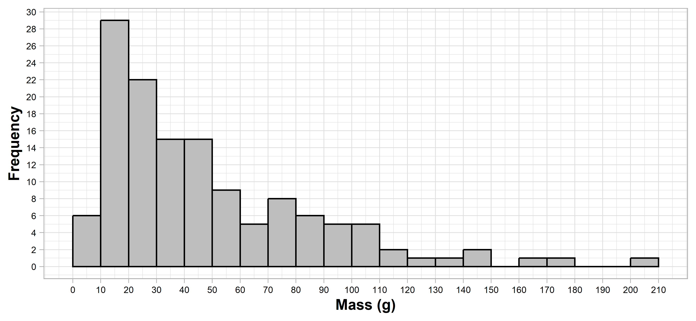
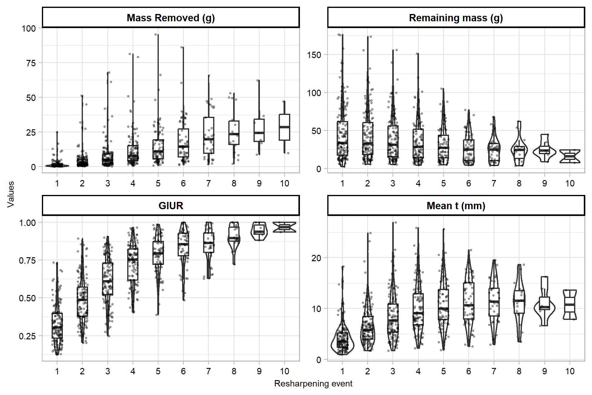
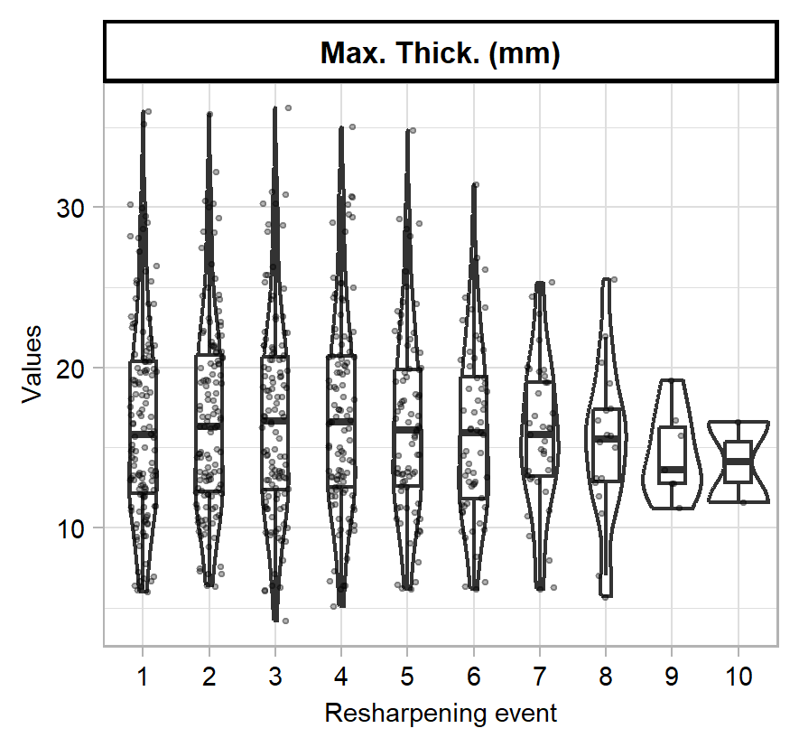
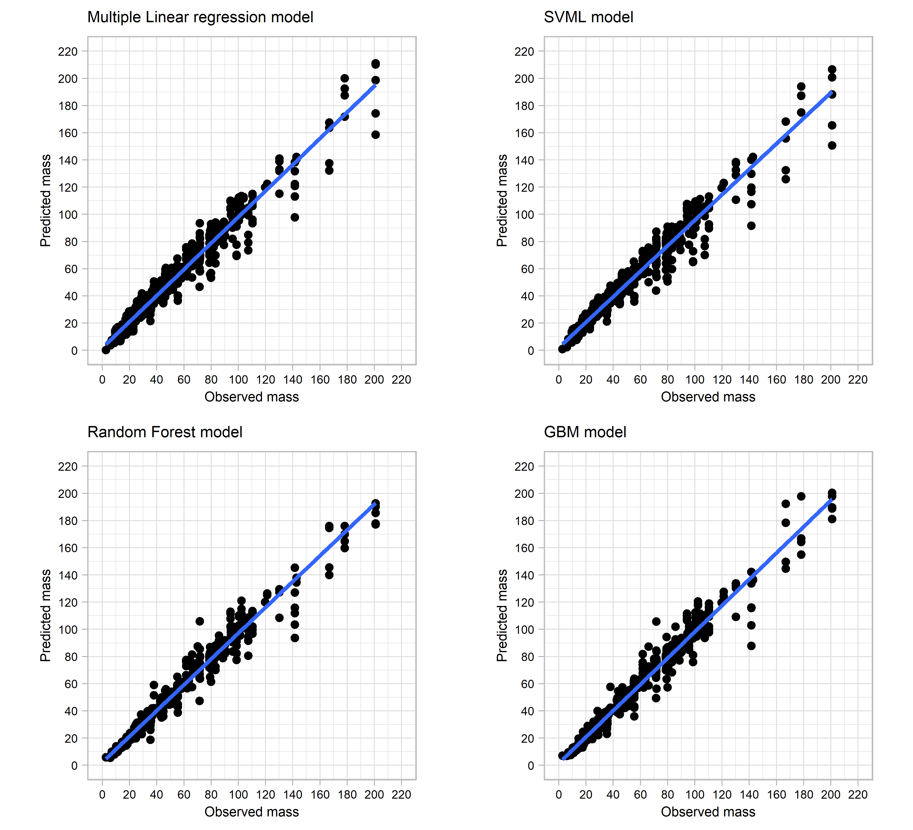
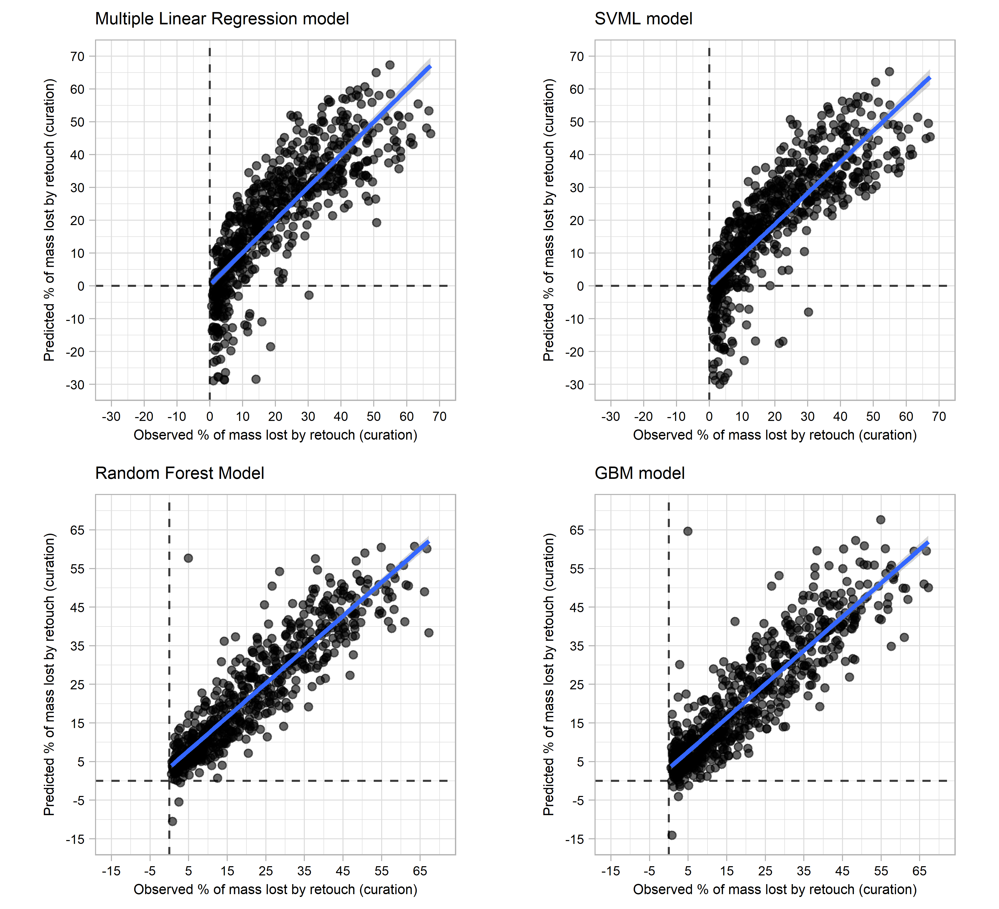
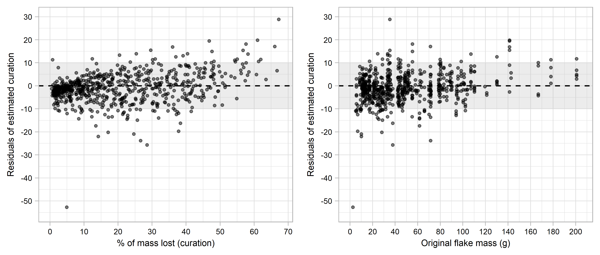
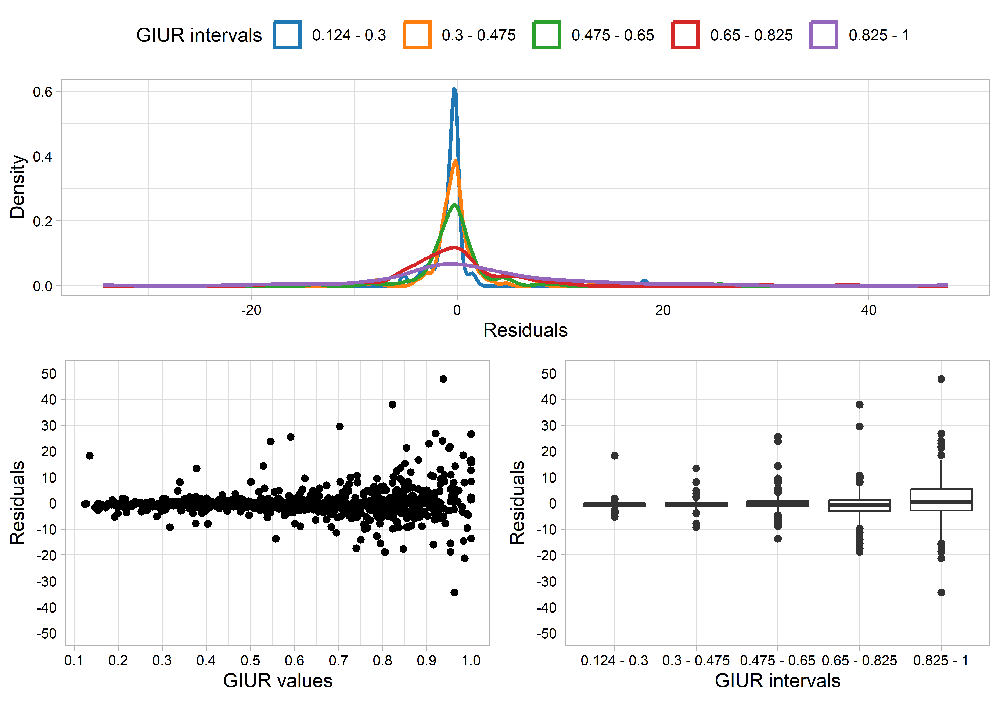
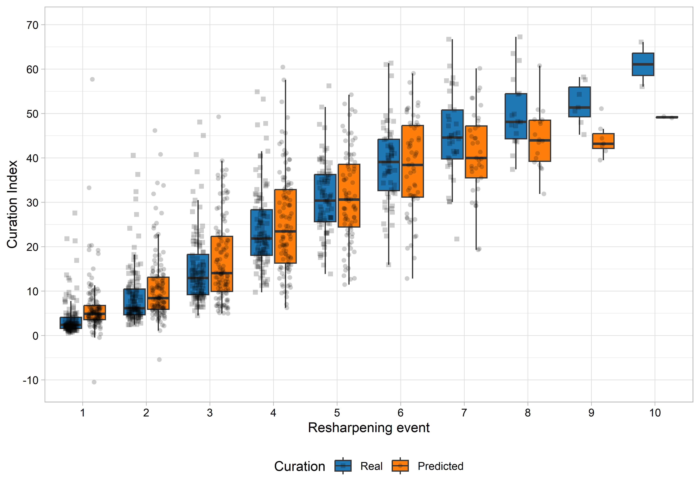

# 1 **Scraper original mass: a different approach and its wide range implementation**

Guillermo Bustos-Pérez <sup>(1, 2, 3)</sup>

<sup>(1)</sup> Department of Human Origins, Max Planck Institute for
Evolutionary Anthropology, Leipzig.  
<sup>(2)</sup> Institut Català de Paleoecologia Humana i Evolució Social
(IPHES-CERCA), Tarragona, Spain.  
<sup>(3)</sup> Departament d’Història i Història de l’Art, Universitat
Rovira i Virgili, Tarragona, Spain.

## 1.1 **Abstract**

Predicting the original mass of a retouched scraper has long been a
major goal in lithic analysis. It is commonly linked to lithic
technological organization of past societies along with notions of stone
tool general morphology, standardization through the reduction process,
use life, and site occupation patterns. In order to obtain a prediction
of original stone tool mass, previous studies have focused on attributes
that would remain constant or unaltered through retouch episodes.
However, these approaches have provided limited success for predictions
and have also remained untested in the framework of successive
resharpening episodes. In the research presented here, a set of
experimentally knapped flint flakes were successively resharpened as
scraper types. After each resharpening episode, four attributes were
recorded (scraper mass, height of retouch, maximum thickness and the
GIUR index). Four machine learning models were trained using these
variables in order to estimate the mass of the flake prior to any
retouch. A Random Forest model provided the best results with an
*r*<sup>2</sup> value of 0.97 when predicting original flake mass, and a
*r*<sup>2</sup> value of 0.84 when predicting percentage of mass lost by
retouch. The Random Forest model has been integrated into an open source
and free to use Shiny app. This allows for the wide spread
implementation of a highly precise machine learning model for predicting
initial mass of flake blanks successively retouched into scrapers.  
 

**Key words:** experimental archaeology; lithic reduction; flake mass;
machine learning.

 

## 1.2 **1. Introduction.**

  Scrapers are some of the most common lithic implements among
archaeological lithic assemblages. They are present from the first
Oldowan stone tools
\[[1](#ref-barsky_early_2011)–[3](#ref-semaw_26-million-year-old_2003)\]
through to modern ethnographic studies of hunter gatherers
\[[4](#ref-casamiquela_temas_1978)–[7](#ref-sillitoe_living_2003)\]. The
“reduction model”
\[[8](#ref-dibble_middle_1995),[9](#ref-dibble_interpretation_1987)\]
suggests that some stone tools (including scrapers) can represent
different stages of reuse and modification through retouch. When
considering scrapers within the reduction model, an integral concept is
that of curation. The initial definition of curation included a series
of behavioral patterns related to provisioning strategies
\[[10](#ref-binford_organization_1979),[11](#ref-renfrew_interassemblage_1973)\].
However, further authors included into curation behavioral strategies
such as tool transport, utilization in a wide range of tasks,
anticipated production, hafting, and recycling (after the original tool
had been discarded). An alternative definition of curation was proposed
by Shott
\[[12](#ref-shott_exegesis_1996),[13](#ref-shott_tool-class_1989)\], who
defined curation as “the ratio of realized to potential utility”
\[[14](#ref-shott_use_2005)\]. This new approach to the definition of
curation has important implications for lithic analysis and the study of
lithic technological organization since it transforms curation into a
continuous variable \[[12](#ref-shott_exegesis_1996)\]. Given this new
definition, and in the framework of the reduction model, the amount of
mass lost by a lithic artifact by reuse/resharpening will be equivalent
to its ratio of curation. Both, absolute (mass in grams) and relative
(percentage of mass lost), variables can be empirically calculated in
experimental contexts and estimated in archaeological contexts.

The presence of scrapers and their curation relates to several aspects
of the organization of lithic technology of past societies
\[[23](#ref-clarkson_changing_2008)\]. Amount of curation affects the
shape of stone tools at the moment of their discard (thus affecting the
morphological variability of stone tool assemblages observed through
time). Amount of curation can also relate to raw material sources, with
more curated artifacts coming from longer distances
\[[24](#ref-andrefsky_raw-material_1994),[25](#ref-nelson_study_1991)\].
Curation also relates to the selection of technological products for
more intensive retouch, or shifts in technological strategies of
transport, thus informing about the cultural choices and patterns of
past human groups
\[[26](#ref-blades_end_2003),[27](#ref-andrefsky_reduction_2008)\].
Finally, curation also relates to tool use and use-wear analysis.

Because of these reasons, predicting original scraper mass is a major
goal in lithic analysis. Thus far, two approaches are employed to
estimate the reduction and curation undergone by a retouched artifact.
The first approach uses estimations derived from direct measurements on
retouch. This has led to the proposal of several indexes using different
measurements, such as height of retouch, length of retouched edge or
projection of the original angle
\[[28](#ref-bustos-perez_exploring_2019)–[32](#ref-morales_measuring_2015)\].
These indices usually provide good correlation values with mass lost,
but they are usually conditioned by flake morphology, direction of
retouch, or tool type (laterally retouched scrapers, endscrapers,
bifacial products, etc.) and each one uses different scale ranges.

The second approach aims at estimating original flake mass based on
remaining flake features. This approach has the advantage of not being
limited by tool type, direction of retouch or flake morphology. Initial
work focused on controlled experiments of flake formation using
different measures of flake platform (width, depth) and exterior
platform angle (EPA) to estimate flake mass
\[[33](#ref-dibble_platform_1997)–[37](#ref-pelcin_controlled_1996)\].
Some of the reasons to select these features were that they usually
remain unaltered in most retouched artefacts. These controlled
experiments provided strong explanatory power for the formation of
flakes, with flake mass being predicted with an *r*<sup>2</sup> value
above 0.8
\[[34](#ref-dibble_effect_1995),[38](#ref-li_synthesis_2023)\]. However,
when the same variables are used to predict mass of experimentally
knapped flakes, the predictive power of the model diminishes
significantly, with *r*<sup>2</sup> values dropping to 0.403
\[[39](#ref-davis_quantifying_1998)\] 0.224 for the same retouched
flakes), and 0.384 \[[40](#ref-shott_flake_2000)\]. These results meant
an important drawback since, as Dibble
\[[41](#ref-dibble_comment_1998)\] states: *“controlled experiments, in
spite of their elegance, objectivity and replicability, are only useful
if the results obtained from them are directly applicable to
archaeological materials”*.

To overcome the limitations from these results, three approaches are
commonly undertaken:

1.  Adding additional features as predictive variables. Commonly flake
    thickness is added
    \[[20](#ref-shott_use_2017),[42](#ref-dogandzic_edge_2015)\], since
    it is widely considered to remain unaltered through the reduction
    process. Other variables, such as scar count or remaining amount of
    cortex, seem to improve the predictive power of models
    \[[43](#ref-bustos-perez_predicting_2021),[44](#ref-bustos-perez_multiple_2022)\].

2.  Applying new methods for measuring more accurately existing
    variables. Examples are the refinement on traditional manual
    measurements of platform \[[45](#ref-muller_new_2016)\], the use of
    digital photographs \[[46](#ref-braun_landscape-scale_2008)\], or 3D
    scans for measuring platform
    \[[47](#ref-clarkson_estimating_2011),[48](#ref-maloney_experimental_2020)\].

3.  Applying different families of transformations in order to favor the
    Gaussian distribution of values of predictors and flake mass, thus
    increasing the predictive power of most models. These
    transformations usually use the cubic root
    \[[38](#ref-li_synthesis_2023),[42](#ref-dogandzic_edge_2015),[49](#ref-dogandzic_results_2020)\]
    or different logarithmic transformations
    \[[39](#ref-davis_quantifying_1998),[40](#ref-shott_flake_2000),[43](#ref-bustos-perez_predicting_2021),[44](#ref-bustos-perez_multiple_2022),[47](#ref-clarkson_estimating_2011),[48](#ref-maloney_experimental_2020)\].

It can be considered that these additions and improvements have provided
correlation values of original flake mass on scrapers which allow for
comparisons at the assemblage level. However, estimations at the
individual stone artifact level remain unsatisfactory with a limited
application to archaeological cases. This is due to three main reasons.
First, while most research explores extensively the prediction of mass
through different variables (and their interactions), it is usually not
considered in the frame of continuous resharpening process, and when it
is tested in this framework (continuous or single episodes of retouch),
results provide lower correlation values
\[[39](#ref-davis_quantifying_1998),[48](#ref-maloney_experimental_2020)\].
Second, while most research aims at estimating original flake mass, less
research provides results of estimations of percentage of mass lost
against actual percentage of mass lost during retouch, which is the key
component of the curated concept
\[[6](#ref-shott_measuring_2007),[12](#ref-shott_exegesis_1996)\].
Third, most archaeological research addressing the prediction of
original flake/scraper mass result in equations which might be difficult
to extrapolate and practically apply other archaeological assemblages
\[[20](#ref-shott_use_2017),[39](#ref-davis_quantifying_1998),[50](#ref-morales_distribution_2016)\].
Recently
\[[43](#ref-bustos-perez_predicting_2021),[44](#ref-bustos-perez_multiple_2022)\],
the use of machine learning has allowed the implementation of feature
selection (identification of how many and which variables are better for
prediction) and new algorithms. However, it has also resulted in limited
improvements of the correlation coefficient
\[[44](#ref-bustos-perez_multiple_2022)\], indicating that a possible
threshold limit for this approach is being reached.

A new framework is needed to overcome the limitations of previous models
(absence of being tested in sequential experimentations, higher
accuracy, and easy implementation for all lithic analysts) aimed at
predicting original flake mass from scraper attributes and being able to
reach the individual scraper level. In the present study 134 flakes were
successively retouched, providing a dataset of 694 episodes of
resharpening. After each retouch episode, a series of attributes were
measured and used to train four machine learning models and the best
performing model is further evaluated for issues of collinearity and
implemented through a Shiny app “Original Scraper Mass Calculator
v.1.0”, which allows the user to manually introduce the data from a
scraper to estimate its original mass or to upload all data at once and
download the results.

## 1.3 **2. Materials and methods**

### 1.3.1 **2.1 Experimental sample**

The analyzed sample consisted of 134 experimentally knapped flakes using
hard hammer. The raw material of hammerstones varied widely (quartz,
quartzite, sandstone, and limestone), which allowed for a diverse range
of morphologies and potential active percussion areas. The experimental
sample is dominated by flakes with feather terminations (n = 121;
90.3%), followed by flakes with hinge terminations (n = 10; 7.46%).

Initial flake mass was recorded using a Sytech SY-BS502 with a precision
of 0.01 grams. Average weight of the samples was 47.38 g, with 50% of
flakes weighing between 18.07 and 63.16 g, and a standard deviation of
36.48. Figure 1 presents the flake mass distribution for the
experimental sample, indicating a long tail of 14 flakes weighing more
than 100 g.

The transversal section of flakes is considered to have an important
effect on estimations derived from the geometric index of unifacial
reduction (GIUR) \[[31](#ref-kuhn_geometric_1990)\] and height of
retouch. In particular, when a flake’s dorsal surface is parallel to the
ventral surface, the GIUR and height of retouch will only marginally or
will not at all increase after each resharpening episode, resulting in
underestimations of flake mass removal
\[[8](#ref-dibble_middle_1995),[30](#ref-eren_kuhns_2009)\]. However,
the actual effect of the *“flat flake problem”* on the estimation of
flake mass might be marginal
\[[51](#ref-hiscock_reality_2009),[52](#ref-hiscock_experimental_2005)\].
The present study recorded flake schematic transversal section prior to
retouch of each flake, with possible categories being: circular (n =
20), triangular (n = 63), triangular asymmetric (n = 29), trapezoidal (n
= 13) and trapezoidal asymmetric (n = 9). The first three categories are
considered to represent cases where the “flat flake problem” is not
present, while the latter two are consider to represent cases were this
problem is present.

 

``` r
Summary_Assem <- data.frame(
  rbind(data.frame(data.matrix(summary(Unr.Flaks$Length))) %>% t(),
        data.frame(data.matrix(summary(Unr.Flaks$Width))) %>% t(),
        data.frame(data.matrix(summary(Unr.Flaks$Mid.Thick))) %>% t(),
        data.frame(data.matrix(summary(Unr.Flaks$Max.Thick.mm))) %>% t(),
        data.frame(data.matrix(summary(Unr.Flaks$Mean.Edge.Angle.Selected.ret))) %>% t()
        ))
Measure <- c("Length", "Width", "Middle Thickness", "Maximum thick",
             "Mean angle edge before retouch")
SD <- c(sd(Unr.Flaks$Length), sd(Unr.Flaks$Width), sd(Unr.Flaks$Mid.Thick), sd(Unr.Flaks$Max.Thick.mm), sd(Unr.Flaks$Mean.Edge.Angle.Selected.ret))

Summary_Assem <- cbind(Measure, Summary_Assem, SD)
Summary_Assem <- Summary_Assem %>% 
  mutate(CV = SD/Mean)

kableExtra::kable(Summary_Assem, digits = 2, row.names = FALSE, col.names = c("Measure", "Min.", "1st.Qu.", "Median", "Mean", "3rd.Qu.", "Max", "SD", "CV"), booktabs = TRUE, format = "pipe") 
```

| Measure | Min. | 1st.Qu. | Median | Mean | 3rd.Qu. | Max | SD | CV |
|:------------------------|----:|------:|------:|-----:|------:|------:|-----:|----:|
| Length | 24.5 | 50.95 | 62.60 | 63.23 | 75.80 | 106.70 | 16.90 | 0.27 |
| Width | 17.4 | 40.70 | 47.25 | 49.95 | 58.25 | 90.40 | 13.90 | 0.28 |
| Middle Thickness | 4.2 | 9.83 | 13.40 | 14.43 | 18.62 | 34.70 | 6.23 | 0.43 |
| Maximum thick | 6.0 | 12.03 | 15.80 | 16.57 | 20.00 | 36.00 | 6.31 | 0.38 |
| Mean angle edge before retouch | 13.5 | 33.08 | 39.84 | 41.27 | 48.67 | 72.33 | 12.32 | 0.30 |

<span id="tab:table-summary-stats"></span>Table 1.1: Table 1. Summary
statistics of dimensions for the experimental sample

 

``` r
Data2 %>% group_by(Flake.ID) %>% 
  summarise(Mass = mean(Or.Weight.g)) %>% 
  ggplot(aes(Mass)) +
  geom_histogram(binwidth = 10,
                 color = "black", fill = "gray", 
                 boundary = 0) +
  theme_light() +
  ylab("Frequency") +
  xlab("Mass (g)") +
  scale_x_continuous(breaks = seq(0, 210, 10)) +
  scale_y_continuous(breaks = seq(0, 30, 2)) +
  theme(
    axis.text = element_text(color = "black", size = 6),
    axis.title = element_text(color = "black", size = 10, face = "bold"))
```


<p class="caption">
<span id="fig:hist-org-mass"></span>Figure 1.1: Figure 1. Histogram of
mass distribution for the experimental sample of flakes
</p>

All flakes were retouched until they were too small to hold while
retouching (n = 4), they broke during retouch (n = 74), or the angle of
retouch was too abrupt to detach additional resharpening flakes (n =
59). Retouch was done through freehand direct hard hammer on the dorsal
face of flakes (direct retouch). In order to reshape the flakes one
continuous retouched edge was established. After the first episode of
resharpening, the retouched edge was expanded through the flakes edge in
a continuous manner. This limits the potential application of this index
to simple scrapers with direct retouch (which excludes double scrapers
or scrapers with inverse or bifacial retouch).

Most flakes underwent between four and seven episodes of retouch
(67.2%), while only seven flakes provided nine or more episodes of
retouch. The experimental assemblage provided a total of 694
resharpening episodes with which to train the predictive models.

### 1.3.2 **2.2 Feature selection**

Based on previous research
\[[31](#ref-kuhn_geometric_1990),[42](#ref-dogandzic_edge_2015),[43](#ref-bustos-perez_predicting_2021),[52](#ref-hiscock_experimental_2005)\]
variables were recorded as predictive features. After each episode of
retouch, the following variables were recorded:

-   Remaining scraper mass, recorded in grams with a Sytech SY-BS502
    scale and a precision of 0.01 g. This variable is selected since
    machine learning models will consider remaining flake mass as a
    baseline on minimum mass of the scraper.

-   Maximum thickness of the flake measured in mm (with a precision of
    0.1). Feature selection through all possible combination of
    variables indicates that the logarithmic (base 10) transformation of
    this variable can increase the predictive power of regression models
    for freehand knapped flakes. Logarithmic transformation can result
    in Gaussian distribution of feature values increasing the predictive
    power of a model \[[43](#ref-bustos-perez_predicting_2021)\]. It is
    also considered that as resharpening proceeds, the thickness at the
    midpoint will be displaced (since length and width will diminish),
    while maximum thickness will remain more stable.

-   Three equidistant measures of height of retouch (t) and the
    corresponding thickness (T) of the flake
    \[[52](#ref-hiscock_experimental_2005)\] measured in mm (with a
    precision of 0.1). The average of these three points is used as a
    predictive feature. Here it is considered that the average height of
    the retouch will serve as a proxy of mass removed from the scrapper.

-   The GIUR index proposed by Kuhn \[[31](#ref-kuhn_geometric_1990)\].
    . This index divides the height of retouch (t) by its corresponding
    thickness (T). As previously indicated, the present study records
    three equidistant heights of retouch (t), each being divided by
    their corresponding flake thickness (T). The GIUR value is
    calculated as the average of these three divisions. GIUR values can
    range from 0 (unretouched flake) to 1 (when the height of the
    reaches the dorsal side of a flake).

The four variables were selected for training the regression models
were: scraper mass, maximum thickness (log transformed), average height
of retouch (t) and value of the GIUR index.

 

### 1.3.3 **2.3 Regression models and evaluation**

Four methods were employed for regression analysis: multiple linear
regression, support vector regression with a linear kernel, random
forest and gradient boosting machine.

Multiple linear regression (MLR) extends the simple linear regression in
such a way that it can directly accommodate multiple predictors
\[[53](#ref-james_introduction_2013): 71\].

Support vector machines for regression
\[[54](#ref-awad_support_2015),[55](#ref-cortes_support-vector_1995)\]
with a linear kernel (SVML) fit a linear hyperplane and a margin of
error which allows for errors of points falling inside the margin.
Points falling outside the margin define the support vectors. This
provides a model focused on the general trend which aims to maximize the
margin while minimizing the error, and which is also robust to the
presence of outliers.

Random forest for regression selects random samples of the data and
builds decision trees for prediction \[[56](#ref-breiman_random_2001)\].
As a result, each tree is built from different combinations of the data,
and the average is used as prediction. This adds diversity, reduces
overfit, and provides high-accuracy predictions
\[[57](#ref-lantz_machine_2019)\].

The gradient boosting machine (GBM) is an ensemble method that builds up
a final model by incrementally improving an existing one
\[[58](#ref-friedman_stochastic_2002),[59](#ref-friedman_greedy_2001)\].
The first model uses an initial *“shallow tree”* with a constant value
(average of the labels). Following this initial model, a new tree (*weak
learner*) is fitted to predict the residuals of the model, contributing
to the final model predictions, allowing for correction of the errors of
the model. This process is repeated, allowing it to progressively
identify the shortcomings of week learners on a sequence of decision
trees and to reduce the errors of the ensemble predictions.

Initial models are trained to estimate original scraper mass based on
the set of selected attributes. However, as previously stated, the
objective is to evaluate the ability of a model to predict the curation
ratio of a stone tool (percentage of mass remaining relative to its
original mass). Calculating the curation ratio of a stone tool can be
formulated as:

100 − ((*M*/*E**O**M*) \* 100)
  Where:

M = mass (directly measured on the scraper).

EOM = estimated original mass (provided by the model).

Models of both predictions (original scraper mass and curation ratio)
are compared using four measures of performance: *r*<sup>2</sup>, MAE,
RMSE, and MAPE. *r*<sup>2</sup> is a measure of linear correlation and
of how much of the observed variation is explained by the model
\[[53](#ref-james_introduction_2013)\]. In lithic studies, a
categorization of the predictive power of indices has been proposed
based on their *r*<sup>2</sup> values
\[[60](#ref-hiscock_generalization_2010)\], where \<0.1 is low, 0.1–0.25
is moderate, 0.26–0.5 is fairly large/strong, 0.51–0.8 is very
large/strong and \>0.8 is extremely large/strong
\[[60](#ref-hiscock_generalization_2010)\]. However, it is important to
consider that different distributions of data can result in same or
similar *r*<sup>2</sup> values \[[61](#ref-anscombe_graphs_1973)\].

Mean average error (MAE), root mean squared error (RMSE), and mean
average percentual error (MAPE) provide summary values of how far
predictions fall from the true value
\[[53](#ref-james_introduction_2013),[57](#ref-lantz_machine_2019)\].
MAE measures the average magnitude of errors, regardless of signal. RMSE
also provides a measure of distance between predicted and actual values,
although it punishes large errors. RMSE is usually compared to the
standard deviation (SD) of the variable to be predicted. If RMSE
presents a lower value than the SD, this is indicative of a good model
which predicts values better than taking the average value of the
sample. MAPE provides a measure of distance on a proportional basis (a
residual of 3 g in a 12 g flake will be much higher than in a 50 g
flake). A perfect model has a MAE, RMSE, and MAPE values of 0, and in
general, better models will have lower values of MAE, RMSE, and MAPE.

Collinearity of the predictors is addressed through the variance
inflation factor (VIF). VIF provides a measure of correlation between
predictors and their effects on the model. In the present study VIF is
calculated using the R package *car* v.3.1.2. \[[62](#ref-fox_r_2018)\].
Common thresholds for VIF values
\[[63](#ref-marquardt_generalized_1970),[64](#ref-obrien_caution_2007)\]
range between 1 to 10 (considered inconsequential); 10 to 30 (cause for
concern), and higher than 30 (seriously harmful). At present, the
package *car* v.3.1.2 only allows for the calculation of the variance
inflation factor for multiple linear regression. Although the different
nature of the regression algorithms can result in different effects of
collinearity, results from calculating the variance inflation factor in
the multiple linear regression can be extrapolated to the rest of the
models. Usually collinearity falls into two categories: data base
collinearity (which results from the collection of data from the
experiment) and structural collinearity (when new independent variables
are generated from one or more existing predictive variables). Data base
collinearity can be considered especially harmful, since collinearity
present in the training dataset might not be present on new data on
which to make predictions. However, since structural collinearity is the
result of existing variables, it is expected to be present at training
and new. It is expected that the GIUR index and average height of
retouch will present higher values of structural collinearity. In order
to further address the effect of collinearity, a principal component
analysis (PCA) was performed on the four variables, and a new model was
trained on the Principal Components (PC) adding up to more than 90% of
variance. PCA is common dimensionality reduction technique which allows
to eliminate collinearity between predictors, while minimizing the loss
of information \[[65](#ref-naes_understanding_2001)\]. The distribution
of predictions from both models are compared through Kolmogorov-Smirnov
test. If collinearity between predictors is having causing overfit, the
distribution of predicted values will be statistically significantly
different.

Models were evaluated using a k-fold cross validation. In k-fold cross
validation, the dataset is randomly shuffled and divided into k folds.
The first fold is employed as a test set, and the model is trained in
the remaining folds. After this, the second fold is employed as a test
set and the rest as a new training set. This process continues until all
folds have served as a test set. Since the samples in each fold are
determined by the initial random shuffle, it is advisable to repeat this
cycle a series of times. The present work employs a 10-fold cross
validation (six folds having a sample of 69 elements, and four folds
having a sample of 70 elements) which is repeated 50 times with an
initial random shuffling.

In addition to the above listed performance metrics, all models are
graphically evaluated. A regression plot provides a scatter plot of
predicted and true values along its regression line. In a good model,
the regression line will pass through the center of all points, which
will be evenly distributed above and below, and outliers are visible.

The distribution of residuals (difference between predicted and actual
values) allows for an evaluation of bias in the model. In the present
study residuals are used in combination with transversal section and
different intervals of the GIUR index in order to determine possible
bias or limitations of the model. Residuals plots of a good model will
have the points evenly distributed around zero across the range of the
independent variables, and no statistical difference will exist between
the categories of flake transversal section or GIUR intervals.
Evaluation of residuals is only undertaken for the considered best
model.

The evaluation of models using the k-fold cross validation was performed
using the complete dataset of 698 resharpening episodes from the 134
flakes. This implies that, for a prediction, previous and posterior
resharpening episodes of the same flake were included in the training
data set. This raises the question whether the model is overfitting from
seeing previous and posterior resharpening examples of the same flake.
In order to evaluate this possible source of overfitting, a random
selection of 10% (n = 13) of flakes and all their resharpening episodes
were removed from the training set and the remaining sample used to
train the previously selected best model. This process was repeated
until 100000 predictions were obtained and then the four measures of
performance were calculated. In this scenario, a significant decrease in
model performance suggests overfitting in the full sample that includes
multiple stages of the same flake.  
Additionally, two models were trained for comparison using the sample of
134 flakes. The first model uses the same set of variables from
Bustos-Pérez & Baena Preysler \[[44](#ref-bustos-perez_multiple_2022)\]
in order to predict original flake mass (log transformed). The second
model used log transformations of platform size and maximum thickness
along with exterior platform angle as predictive variables in order to
predict the cubic root of flake mass. Both models were trained using a
multiple linear regression, and predicted values were transformed to the
linear scale in order to compare performance metrics with those of the
best model from the current study.

The complete workflow was developed in RStudio IDE v.2024.04.02
\[[66](#ref-rstudio_team_rstudio_2019)\] using the R programming
language v.4.4.1 \[[67](#ref-r_core_team_r_2019)\]. The package
tidyverse v.2.0.0 \[[68](#ref-wickham_welcome_2019)\] was employed for
data manipulation and representation. Multiple linear regression uses
the R package MASS v.7.3.60.2 \[[69](#ref-venables_modern_2002)\], SVM
with linear kernel uses package kernlab v.0.9.32
\[[70](#ref-karatzoglou_kernlab_2004)\], the random forest model uses
packages e1071 v.1.7.14 and ranger v.0.16.0
\[[70](#ref-karatzoglou_kernlab_2004),[71](#ref-wright_ranger_2015)\],
and GBM uses package gbm v.2.2.2
\[[72](#ref-ridgeway_generalized_2007)\]. Training and validation of
models was done using the package caret v.6.0.94
\[[73](#ref-kuhn_building_2008)\]. The “Original Scraper Mass
Calculator” which implements the model through a user friendly interface
was written using the shiny package v.1.8.1.1
\[[74](#ref-chang_package_2015)–[76](#ref-wickham_mastering_2021)\]. All
data, code is made publicly available through a public repository
organized following the structure of a research compendium
\[[77](#ref-marwick_packaging_2018)\] and using a markdown document
through package bookdown v.0.39
\[[78](#ref-mcnamara_dynamic_2014)–[80](#ref-xie_bookdown_2016)\].  
All data and the complete workflow of analysis is available as a
research compendium \[[77](#ref-marwick_packaging_2018)\] at Github
(<https://github.com/GuillermoBustosPerez/Scraper-Original-Mass/tree/main>).
The complete code and files of the Original Scraper Mass calculator
v.1.0.0 is also available at Github
(<https://github.com/GuillermoBustosPerez/Original-Scraper-Mass-Calculator>),
and the final implementation of the application can be accessed at:
<https://guillermo-bustos-perez.shinyapps.io/Original-Scraper-Mass-Calculator/>  
 

## 1.4 **3. Results**

### 1.4.1 **3.1 Resharpening effects on the experimental assemblage**

Figure 2 presents the effects of each resharpening episode on the
experimental assemblage. On average, flakes from the first episode of
retouch had 1.84 g removed (with the exception of an outlier flake which
had 25 g removed). Maximum value of mass removed was of 95.5 g after
five episodes of retouch, while flakes reaching ten episodes of retouch
had an average of 28.4 g removed. As for the retouched pieces, mass of
the assemblage decreased from 45.9 g after the first episode of retouch
to 15.9 g after ten episodes of retouch. On average, the resharpening
episodes removed 20% (with a standard deviation of 15.9%) of mass from
the scrapers. One resharpening episode removed a minimum of 0.513%, and
a resharpening episode removed a maximum of 67.3% of mass. 50% of the
resharpening episodes removed between 5.9% and 31.3% of mass.

``` r
# Resharpenning 
Data2 %>% select(Episode, GIUR, W.Retrieved.g, Mean.t, Rem.Weight.g) %>% 
  pivot_longer(
    cols = c(GIUR:Rem.Weight.g),
    values_to = "Values",
    names_to = "Variables") %>% 
  
  ggplot(aes(as.factor(Episode), Values)) +
  facet_wrap(~ factor(Variables, 
                      levels = c("W.Retrieved.g", "Rem.Weight.g", "GIUR",  "Mean.t"),
                      labels = c( "Mass Removed (g)", "Remaining mass (g)", "GIUR", "Mean t (mm)")) , 
             scales = "free") +
  geom_violin() +
  geom_boxplot(width = 0.4, outlier.shape = NA) + 
  geom_jitter(width = 0.2, alpha = 0.3, size = 0.4) +
  theme_light() +
  xlab("Resharpening event") +
  theme(
    axis.text = element_text(color = "black", size = 7),
    axis.title = element_text(color = "black", size = 7),
    strip.text = element_text(color = "black", face = "bold", size = 8),
    strip.background = element_rect(fill = "white", colour = "black", linewidth = 1))
```


<p class="caption">
<span id="fig:initial-plot"></span>Figure 1.2: Figure 2. Box and violin
plots of mass removed, remaining mass, GIUR index, and mean height of
retouch (t), of the experimental assemblage according to each
resharpening event.
</p>

In general, the GIUR remains fairly unidirectional, with increasing
values after each episode of resharpening. The average GIUR after the
first resharpening episode was 0.33. The first maximum GIUR value (1)
was reached after six episodes of resharpening. Only six flakes of the
experimental assemblage reached a GIUR values of 1, providing a total of
eight different episodes. Mean height of retouch (t) increases during
the first seven resharpening episodes, from an average value of 4.19 mm
after the first episode, to a value of 11.4 mm after the seventh
episodes. Average height of retouch (t) decreases progressively
afterwards to a value of 10.8 mm on episode 10 of retouch. This decrease
in average t is result of retouch reaching the upper dorsal side of
flakes and diminishing the overall thickness.

Maximum thickness (Figure 3) remained fairly constant among all the
resharpening events, although the range of values decreases with each
resharpening episode (this is due to a decrease in the number of flakes
due to discard). After eight resharpening events, a light decrease in
maximum thickness is observed due to retouch reaching the upper dorsal
part of flakes, and reducing its overall thickness.

``` r
Data2 %>% select(Episode, Max.Thick.mm) %>% 
  pivot_longer(
    cols = c(Max.Thick.mm),
    values_to = "Values",
    names_to = "Variables") %>% 
  
  ggplot(aes(as.factor(Episode), Values)) +
  facet_wrap(~ factor(Variables, 
                      levels = c("Max.Thick.mm"),
                      labels = c("Max. Thick. (mm)")) , 
             scales = "free") +
  geom_violin() +
  geom_boxplot(width = 0.4, outlier.shape = NA) + 
  geom_jitter(width = 0.2, alpha = 0.3, size = 0.4) +
  theme_light() +
  xlab("Resharpening event") +
  theme(
    axis.text = element_text(color = "black", size = 7),
    axis.title = element_text(color = "black", size = 7),
    strip.text = element_text(color = "black", face = "bold", size = 8),
    strip.background = element_rect(fill = "white", colour = "black", linewidth = 1))
```


<p class="caption">
<span id="fig:fig-3-max-thick"></span>Figure 1.3: Figure 3. Box and
violin plots of maximum thickness.
</p>

### 1.4.2 **3.2 Evaluation of regression models.**

Table 2 presents performance metrics of each of the regression models
for predicting original flake mass. All models had RMSE values lower
than the standard deviation of original flake mass, indicating a good
fit of the models. The random forest model presented the best values for
all evaluation metrics, being able to capture 0.974 of variance, and
with a MAE of 3.297 g. It also presented the lowest RMSE value (5.917),
indicative of being the least affected by outliers in the predictions.
The lowest MAPE value of 6.775 indicates that the random forest model is
also the least affected by the size of the original blanks. The GBM
model has evaluation metrics similar to those of random forest, being
able to capture a similar proportion of variance (0.971) and slightly
higher values of MAE (3.549) and RMSE (6.185). In general, multiple
linear regression was the model with the worst performance metrics,
capturing slightly more variance than the SVM (respective values of
0.963 and 0.961) and being less affected by the presence of outliers
(respective values of 7.036 and 7.265).

Figure 4 presents the regression plots of all trained models. All models
present regression lines with evenly distributed predictions, indicative
of an absence of bias. However, it is observed for the multiple linear
regression and SVM that with increasing flake mass, the range of
predictions becomes more dispersed.

``` r
source("Scripts/12-tidy-model-predictions.R")

data.frame(
  Model = c("Mult. Linear Reg.", "SVM Linear", "Random Forest", "GBM"),
  r2 = c(
    round(MLR_Model.BS$results[[3]], 4),
    round(SVML_Model.BS$results[[3]], 4),
    round(RF_Model.BS$results[[5]], 4),
    round(GBM_Model.BS$results[[6]], 4)),
  MAE = c(
    round(MLR_Model.BS$results[[4]], 3),
    round(SVML_Model.BS$results[[4]], 3),
    round(RF_Model.BS$results[[6]], 3),
    round(GBM_Model.BS$results[[7]], 3)),
  RMSE = c(
    round(MLR_Model.BS$results[[2]], 3),
    round(SVML_Model.BS$results[[2]], 3),
    round(RF_Model.BS$results[[4]], 3),
    round(GBM_Model.BS$results[[5]], 3)),
  MAPE = c(
    round(MLmetrics::MAPE(MLR_Model.BS$pred$pred, MLR_Model.BS$pred$obs)*100, 3),
    round(MLmetrics::MAPE(SVML_Model.BS$pred$pred, SVML_Model.BS$pred$obs)*100, 3),
    round(MLmetrics::MAPE(RF_Model.BS$pred$pred, RF_Model.BS$pred$obs)*100, 3),
    round(MLmetrics::MAPE(GBM_Model.BS$pred$pred, GBM_Model.BS$pred$obs)*100, 3))
) %>% 
kableExtra::kable(digits = 3)
```

| Model             |    r2 |   MAE |  RMSE |   MAPE |
|:------------------|------:|------:|------:|-------:|
| Mult. Linear Reg. | 0.963 | 4.672 | 7.036 | 12.269 |
| SVM Linear        | 0.961 | 4.394 | 7.265 | 11.304 |
| Random Forest     | 0.974 | 3.297 | 5.917 |  6.775 |
| GBM               | 0.971 | 3.549 | 6.185 |  7.705 |

<span id="tab:table-models-results"></span>Table 1.2: Table 2.
Performance metrics of regression models for predicting original flake
mass

``` r
ggpubr::ggarrange(
  
  (
    Predicted.MLR %>% 
      ggplot(aes(mean.obs, mean.pred)) +
      geom_point() +
      scale_x_continuous(breaks = seq(0, 220, 20), lim = c(0, 220)) +
      scale_y_continuous(breaks = seq(0, 220, 20), lim = c(0, 220)) +
      ggtitle(label = "Multiple Linear regression model") + 
      geom_smooth(method = "lm") +
      coord_fixed() +
      theme_light() +
      ylab("Predicted mass") +
      xlab("Observed mass") +
      theme(
        axis.title = element_text(size = 7),
        axis.text = element_text(size = 6, color = "black"),
        plot.title = element_text(size = 8))
  ),
  (
    Predicted.SVML %>% 
      ggplot(aes(mean.obs, mean.pred)) +
      geom_point() +
      scale_x_continuous(breaks = seq(0, 220, 20), lim = c(0, 220)) +
      scale_y_continuous(breaks = seq(0, 220, 20), lim = c(0, 220)) +
      ggtitle(label = "SVML model") + 
      geom_smooth(method = "lm") +
      coord_fixed() +
      theme_light() +
      ylab("Predicted mass") +
      xlab("Observed mass") +
      theme(
        axis.title = element_text(size = 7),
        axis.text = element_text(size = 6, color = "black"),
        plot.title = element_text(size = 8))
  ),
  
  (
    Predicted.RF %>% 
      ggplot(aes(mean.obs, mean.pred)) +
      geom_point() +
      scale_x_continuous(breaks = seq(0, 220, 20), lim = c(0, 220)) +
      scale_y_continuous(breaks = seq(0, 220, 20), lim = c(0, 220)) +
      ggtitle(label = "Random Forest model") + 
      geom_smooth(method = "lm") +
      coord_fixed() +
      theme_light() +
      ylab("Predicted mass") +
      xlab("Observed mass") +
      theme(
        axis.title = element_text(size = 7),
        axis.text = element_text(size = 6, color = "black"),
        plot.title = element_text(size = 8))
  ),
  (
    Predicted.GBM %>% 
      ggplot(aes(mean.obs, mean.pred)) +
      geom_point() +
      scale_x_continuous(breaks = seq(0, 220, 20), lim = c(0, 220)) +
      scale_y_continuous(breaks = seq(0, 220, 20), lim = c(0, 220)) +
      ggtitle(label = "GBM model") + 
      geom_smooth(method = "lm") +
      coord_fixed() +
      theme_light() +
      ylab("Predicted mass") +
      xlab("Observed mass") +
      theme(
        axis.title = element_text(size = 7),
        axis.text = element_text(size = 6, color = "black"),
        plot.title = element_text(size = 8))
  ),
  ncol = 2,
  nrow = 2
)
```

    ## `geom_smooth()` using formula = 'y ~ x'
    ## `geom_smooth()` using formula = 'y ~ x'
    ## `geom_smooth()` using formula = 'y ~ x'
    ## `geom_smooth()` using formula = 'y ~ x'


<p class="caption">
<span id="fig:regression-plots-mass"></span>Figure 1.4: Figure 4.
Regression plots of each of the trained models when predicting original
flake mass.
</p>

Percentage of flake mass consumed by retouch (curation) was calculated
using estimations of original flake mass for each model and each episode
of resharpening. Table 3 presents performance metrics of the four models
when predicting the curation ratio, and Figure 5 presents their
corresponding regression plots. Important differences can be observed
between models when predicting percentage of mass lost by retouch based
on predictions of original mass. Of the four models, only random forest
and GBM presented adequate performance metrics. Multiple linear
regression presented the lowest performance values, with a linear
correlation value of 0.113, while SVM with linear kernel presented a
significant higher (but still unsatisfactory) r2 value of 0.399. Both
models also presented RMSE values higher than the standard deviation of
percentage of mass lost through retouch (SD = 15.92). Visual evaluation
of the regression plots indicates that the low performance metrics from
both models (multiple linear regression and SVM with linear kernel) seem
to be caused by underestimations original flake mass when a small
percentage of flake mass has been removed by retouch. As a result,
multiple linear regression estimated an original scraper mass value
lower than remaining scraper mass in 127 cases. SVM with linear kernel
estimated an original scraper mass lower than remaining scraper mass in
118 cases.

``` r
ggpubr::ggarrange(
  (
    Predicted.MLR %>% 
      ggplot(aes(Real.Curated, Pred.Curated)) +
      geom_point(alpha = 0.6) +
      geom_smooth(method = "lm") +
      scale_x_continuous(breaks = seq(-30, 70, 10), lim = c(-30, 70)) +
      scale_y_continuous(breaks = seq(-30, 70, 10), lim = c(-30, 70)) +
      ggtitle(label = "Multiple Linear Regression model") +
      coord_fixed() +
      theme_light() +
      geom_vline(xintercept = 0, linetype = "dashed", alpha = 0.75) +
      geom_hline(yintercept = 0, linetype = "dashed", alpha = 0.75) +
      ylab("Predicted % of mass lost by retouch (curation)") +
      xlab("Observed % of mass lost by retouch (curation)") +
      theme(
        axis.title = element_text(size = 6.5),
        axis.text = element_text(size = 6, color = "black"),
        plot.title = element_text(size = 8))
  ),
  (
    Predicted.SVML %>% 
      ggplot(aes(Real.Curated, Pred.Curated)) +
      geom_point(alpha = 0.6) +
      geom_smooth(method = "lm") +
      scale_x_continuous(breaks = seq(-30, 70, 10), lim = c(-30, 70)) +
      scale_y_continuous(breaks = seq(-30, 70, 10), lim = c(-30, 70)) +
      ggtitle(label = "SVML model") +
      coord_fixed() +
      theme_light() +
      geom_vline(xintercept = 0, linetype = "dashed", alpha = 0.75) +
      geom_hline(yintercept = 0, linetype = "dashed", alpha = 0.75) +
      ylab("Predicted % of mass lost by retouch (curation)") +
      xlab("Observed % of mass lost by retouch (curation)") +
      theme(
        axis.title = element_text(size = 6.5),
        axis.text = element_text(size = 6, color = "black"),
        plot.title = element_text(size = 8))
  ),
  (
    Predicted.RF %>% 
      ggplot(aes(Real.Curated, Pred.Curated)) +
      geom_point(alpha = 0.6) +
      geom_smooth(method = "lm") +
      scale_x_continuous(breaks = seq(-15, 70, 10), lim = c(-15, 70)) +
      scale_y_continuous(breaks = seq(-15, 70, 10), lim = c(-15, 70)) +
      ggtitle(label = "Random Forest Model") +
      coord_fixed() +
      theme_light() +
      geom_vline(xintercept = 0, linetype = "dashed", alpha = 0.75) +
      geom_hline(yintercept = 0, linetype = "dashed", alpha = 0.75) +
      ylab("Predicted % of mass lost by retouch (curation)") +
      xlab("Observed % of mass lost by retouch (curation)") +
      theme(
        axis.title = element_text(size = 6.5),
        axis.text = element_text(size = 6, color = "black"),
        plot.title = element_text(size = 8))
  ),
  (
    Predicted.GBM %>% 
      ggplot(aes(Real.Curated, Pred.Curated)) +
      geom_point(alpha = 0.6) +
      geom_smooth(method = "lm") +
      scale_x_continuous(breaks = seq(-15, 70, 10), lim = c(-15, 70)) +
      scale_y_continuous(breaks = seq(-15, 70, 10), lim = c(-15, 70)) +
      ggtitle(label = "GBM model") + 
      coord_fixed() +
      theme_light() +
      geom_vline(xintercept = 0, linetype = "dashed", alpha = 0.75) +
      geom_hline(yintercept = 0, linetype = "dashed", alpha = 0.75) +
      ylab("Predicted % of mass lost by retouch (curation)") +
      xlab("Observed % of mass lost by retouch (curation)") +
      theme(
        axis.title = element_text(size = 6.5),
        axis.text = element_text(size = 6, color = "black"),
        plot.title = element_text(size = 8))
  ),
  ncol = 2,
  nrow = 2)
```

    ## `geom_smooth()` using formula = 'y ~ x'

    ## Warning: Removed 22 rows containing non-finite outside the scale range
    ## (`stat_smooth()`).

    ## Warning: Removed 22 rows containing missing values or values outside the scale range
    ## (`geom_point()`).

    ## `geom_smooth()` using formula = 'y ~ x'

    ## Warning: Removed 21 rows containing non-finite outside the scale range
    ## (`stat_smooth()`).

    ## Warning: Removed 21 rows containing missing values or values outside the scale range
    ## (`geom_point()`).

    ## `geom_smooth()` using formula = 'y ~ x'
    ## `geom_smooth()` using formula = 'y ~ x'


<p class="caption">
<span id="fig:regression-plots-curated"></span>Figure 1.5: Figure 5.
Regression plots of each of the models when predicting the curated ratio
of each of the episodes of retouch.
</p>

Linear correlation values indicate that random forest and GBM perform at
least twice as well than the SVM with linear kernel, with respective r2
values of 0.839 (random forest), and 0.805 (GBM). Both models also
present RMSE values lower than the SD of the sample, indicative of a
good fit of the model. The random forest model presents the best
performance metrics, with the highest linear correlation value (r2 =
0.839) and lowest values for MAE (4.662), RMSE (6.485) and MAPE (0.365).
Random forest is closely followed by the GBM model, with a linear
correlation value of 0.805. Visual evaluation of the regression plots
(Figure 5) reinforces the notion of the good performance of random
forest and GBM. In both cases prediction points are evenly distributed
among the regression lines, and clustering of points in the lower values
(due to over or underestimation of curation) are absent. GBM estimated
an original scraper mass lower than the remaining scraper mass in 8
cases, while random forest made the same error in only three cases.

``` r
data.frame(
  Model = c("MLR", "SVML", "Random Forest", "GBM"),
  `r2 Curated` = c(
    summary(lm(Real.Curated ~ Pred.Curated, Predicted.MLR))$r.squared %>% round(3),
    summary(lm(Real.Curated ~ Pred.Curated, Predicted.SVML))$r.squared %>% round(3),
    summary(lm(Real.Curated ~ Pred.Curated, Predicted.RF))$r.squared %>% round(3),
    summary(lm(Real.Curated ~ Pred.Curated, Predicted.GBM))$r.squared %>% round(3)),
  MAE = c(
    round(caret::MAE(Predicted.MLR$Real.Curated, Predicted.MLR$Pred.Curated), 3),
    round(caret::MAE(Predicted.SVML$Real.Curated, Predicted.SVML$Pred.Curated),3),
    round(caret::MAE(Predicted.RF$Real.Curated, Predicted.RF$Pred.Curated), 3),
    round(caret::MAE(Predicted.GBM$Real.Curated, Predicted.GBM$Pred.Curated), 3)),
  RMSE = c(
    round(caret::RMSE(Predicted.MLR$Real.Curated, Predicted.MLR$Pred.Curated), 3),
    round(caret::RMSE(Predicted.SVML$Real.Curated, Predicted.SVML$Pred.Curated),3),
    round(caret::RMSE(Predicted.RF$Real.Curated, Predicted.RF$Pred.Curated), 3),
    round(caret::RMSE(Predicted.GBM$Real.Curated, Predicted.GBM$Pred.Curated), 3)),
  MAPE = c(
    round(MLmetrics::MAPE(Predicted.MLR$Real.Curated, Predicted.MLR$Pred.Curated), 3),
    round(MLmetrics::MAPE(Predicted.SVML$Real.Curated, Predicted.SVML$Pred.Curated), 3),
    round(MLmetrics::MAPE(Predicted.RF$Real.Curated, Predicted.RF$Pred.Curated), 3),
    round(MLmetrics::MAPE(Predicted.GBM$Real.Curated, Predicted.GBM$Pred.Curated), 3))
  ) %>% 
  kable(digits = 3)
```

| Model         | r2.Curated |    MAE |   RMSE |  MAPE |
|:--------------|-----------:|-------:|-------:|------:|
| MLR           |      0.113 | 11.726 | 54.429 | 1.037 |
| SVML          |      0.536 |  9.537 | 16.103 | 1.449 |
| Random Forest |      0.839 |  4.662 |  6.485 | 0.365 |
| GBM           |      0.805 |  5.189 |  7.160 | 0.449 |

<span id="tab:table-results-curation"></span>Table 1.3: Table 3.
Performance metrics of models when predicting percentage of mass lost by
retouch (curation)

 

None of the predictive variables in the multiple linear regression model
presented VIF values above the threshold of 10. Average height of
retouch (t) presented the highest VIF value (7.27), followed by the GIUR
index (4.59). Log transformed maximum thickness and remaining scraper
mass presented respective VIF values of 3.81 and 2.35. PC1 (68.17%) and
PC2 (26.55%) add up to 94.72% of variance and were selected to train a
new Random Forest. When comparing the distribution of predictions from
both models, no statistically significant difference was fount (D =
0.039; p-value = 0.67), indicating that the predictions from both models
come from the same distribution, and that the original model is not
affected by collinearity.

 

### 1.4.3 **3.3 Bias, limitations of the best model (random forest) and comparison with other models.**

The episodes of resharpening generated 130 cases where the flat flake
problem is observed and 564 cases where this problem is not observed.
Student’s t-test comparing the residual distribution of flat and
non-flat flakes shows no statistical differences (t = -1.93; p = 0.17)
for all episodes of resharpening. When selecting flakes that had four or
more resharpening episodes, no statistical significance is observed for
the residual distribution (t = -0.79; p = 0.43). This indicates that for
the given sample, and the given predictive variables, random forest
predictions are not affected by the flat flake problem.

``` r
ggpubr::ggarrange(
  
  (
    Predicted.RF %>% ggplot(aes(Real.Curated, Residual.Curated)) +
      annotate("rect",
               xmin = -Inf, xmax = Inf, 
               ymin = -10, ymax = 10,  fill = "gray", alpha = .3) +
      geom_hline(yintercept = 0, linetype = "dashed") +
      geom_point(alpha = 0.5, size = 0.8) +
      theme_light() +
      scale_y_continuous(breaks = seq(-50, 30, 10), lim = c(-55, 30)) +
      scale_x_continuous(breaks = seq(0, 70, 10), lim = c(0, 68)) +
      xlab("% of mass lost (curation)") +
      ylab("Residuals of estimated curation") +
      theme(
        axis.text = element_text(color = "black", size = 6),
        axis.title = element_text(color = "black", size = 7)
      )
  ),
  
  (
    Predicted.RF %>% ggplot(aes(mean.obs, Residual.Curated)) +
      annotate("rect",
               xmin = -Inf, xmax = Inf, 
               ymin = -10, ymax = 10,  fill = "gray", alpha = .3) +
      geom_hline(yintercept = 0, linetype = "dashed") +
      geom_point(alpha = 0.5, size = 0.8) +
      theme_light() +
      scale_y_continuous(breaks = seq(-50, 30, 10), lim = c(-55, 30)) +
      scale_x_continuous(breaks = seq(0, 220, 20), lim = c(0, 205)) +
      xlab("Original flake mass (g)") +
      ylab("Residuals of estimated curation") +
      theme(
        axis.text = element_text(color = "black", size = 6),
        axis.title = element_text(color = "black", size = 7)
        
      )
  ),
  ncol = 2
  
)
```


<p class="caption">
<span id="fig:residuals-pots-RF"></span>Figure 1.6: Figure 6. Residual
distribution of estimated curation according to actual curation and
original flake mass.
</p>

Figure 6 presents the distributions of curation residuals (difference
between actual curation and estimated curation) according to real
curation and original flake mass. Average value of curation residuals
for the complete sample was of -0.94. Despite the presence of an extreme
outlier (with a curation overprediction of 52.74%), only 75 episodes
(10.81% of the resharpening episodes) showed cases were curation was
over/under estimated more than 10%. Underprediction of curation seems to
be more common when actual curation presents a value equal or above 55%.
The dataset registered 31 cases were curation ratio was equal or higher
than 55%, of which eleven cases (35.48%) presented an
under/overestimation greater than 10%. When real curation is segmented
into four intervals (Table 4) significant differences is present among
the residual distribution of curation (Kruskal-Wallis test: chi-squared
= 65.38, df = 3, p \< 0.001), with respective average values being
-2.12, -1.35, 1.04 and 7.81. Despite this, little difference is observed
between the performance metrics of the first three intervals of curation
Table 4.  
 

``` r
Predicted.RF %>% mutate(
    Curation.Cut = cut(Real.Curated, 4),
    Mass.Cut = cut(mean.obs, 4)
  ) %>% 
      group_by(Curation.Cut) %>% 
      summarise(
        Count = n(),
        Mean = mean(Residual.Curated),
        MAE = Metrics::mae(Real.Curated, Pred.Curated),
        RMSE = Metrics::rmse(Real.Curated, Pred.Curated),
        MAPE = Metrics::mape(Real.Curated, Pred.Curated)) %>% 
  kable(digits = 3, col.names = c("Curation interval", "Count", "Mean error", "MAE", "RMSE", "MAPE"))
```

| Curation interval | Count | Mean error |   MAE |   RMSE |  MAPE |
|:------------------|------:|-----------:|------:|-------:|------:|
| (0.446,17.2\]     |   364 |     -2.117 | 3.494 |  5.393 | 0.829 |
| (17.2,33.9\]      |   178 |     -1.354 | 5.687 |  7.172 | 0.235 |
| (33.9,50.6\]      |   122 |      1.042 | 5.637 |  6.976 | 0.138 |
| (50.6,67.3\]      |    30 |      7.816 | 8.791 | 10.809 | 0.150 |

<span id="tab:unnamed-chunk-2"></span>Table 1.4: Table 4. Performance
metrics when predicting curation for each of the intervals

 

On general, flakes with an initial mass above 140g presented
underestimations of original mass. The dataset provided 21 resharpening
episodes of flakes with a mass value equal or higher than 140g. Of these
21 episodes, seven cases (33.33%) presented under/overestimations
greater than 10%. When original flake mass is segmented into four
intervals (2.44 to 52.2g; 52.2 to 102g; 102 to 151g; and 151 to 201g)
significant differences is present among the residual distribution of
curation (Kruskal-Wallis test: chi-squared = 26.9, df = 3, p \< 0.001),
with respective average values being -1.58, -0.52, 2.75 and 5.05.

GIUR values can be used as proxies for quality of predictions. Figure 7
presents the residuals (when predicting original flake mass)
distribution of continuous GIUR values and the same divided into five
intervals. A density plot indicates that, on a general level, residuals
tend to peak at the zero value. However, with increasing GIUR intervals
the peak among the zero value diminishes. Scatter and box plots also
indicate that, for higher GIUR values and intervals, a greater range of
residual values is present. This indicates that, although residuals are
evenly distributed around 0, the accuracy of predictions from the random
forest diminishes among heavily retouched flakes (with GIUR values above
0.8).

``` r
Data2 <- Data2 %>% mutate(
    Cat.GIUR = cut(GIUR, 5)) %>% 
  mutate(
    Cat.GIUR = case_when(
      Cat.GIUR == "(0.124,0.3]" ~ "0.124 - 0.3",
      Cat.GIUR == "(0.3,0.475]" ~ "0.3 - 0.475",
      Cat.GIUR == "(0.475,0.65]" ~ "0.475 - 0.65",
      Cat.GIUR == "(0.65,0.825]" ~ "0.65 - 0.825",
      Cat.GIUR == "(0.825,1]" ~ "0.825 - 1")
  )

ggpubr::ggarrange(
  (
    Predicted.RF %>% 
      ggplot(aes(Residuals, color = Data2$Cat.GIUR)) +
      geom_density(size = 1) + 
      theme_light() +
      ggsci::scale_color_d3() +
      labs(color = "GIUR intervals") +
      ylab("Density") +
      theme(
        legend.position = "top",
        axis.text = element_text(size = 8, color = "black")) 
  ),
  
  (
    ggpubr::ggarrange(
      (
        Predicted.RF %>% ggplot(aes(Data2$GIUR, Residuals)) +
          geom_point() +
          scale_x_continuous(breaks = seq(0, 1, by = 0.1)) +  
          scale_y_continuous(breaks = seq(-50, 50, 10), lim = c(-50, 50)) +
          theme_light() +
          xlab("GIUR values") +
          theme(
            axis.text = element_text(color = "black", size = 8)
          )
      ),
      (
        Predicted.RF %>% ggplot(aes(Data2$Cat.GIUR, Residuals)) +
          geom_boxplot() +
          scale_y_continuous(breaks = seq(-50, 50, 10), lim = c(-50, 50)) + 
          theme_light() +
          xlab("GIUR intervals") +
          theme(
            axis.text = element_text(color = "black", size = 8)
          )
      ), 
      ncol = 2)
  ),
  nrow = 2
  )
```

    ## Warning: Using `size` aesthetic for lines was deprecated in ggplot2 3.4.0.
    ## ℹ Please use `linewidth` instead.
    ## This warning is displayed once every 8 hours.
    ## Call `lifecycle::last_lifecycle_warnings()` to see where this warning was
    ## generated.


<p class="caption">
<span id="fig:residuals-GIUR"></span>Figure 1.7: Figure 7. Residual
analysis according to GIUR intervals and continuous values using
density, scatter and boxplots, when predicting flake mass.
</p>

Although knowing how many resharpening episodes an archaeological stone
has undergone tool is unlikely, the availability of the data in a
controlled experimentation allows for a better understanding of possible
bias in the model. Figure 8 presents real and estimated values of
curation according to each resharpening episode. Considering all
episodes of retouch, no statistically significant difference is present
between values of predicted and actual curation (t = 1.12, df = 1382.7;
p = 0.262). However, a statistically significant difference is present
between predicted and actual values of curation for the first episode of
retouch (t = 3.811, df = 224.83; p \< 0.001). This indicates that for
scrapers which have undergone very light retouch, the random forest
model will slightly overpredict their curation ratio. Statistically
significant differences are also present between values of predicted and
actual curation on flakes which have undergone eight or more
resharpening episodes (t = -3.731, df = 48.493; p \< 0.001). This means
that scrapers which have undergone multiple episodes of retouch, with
more than 50% of their mass removed, will have underpredicted curated
ratios (Figure 8).  
 

``` r
read.csv("Data/Results when leaving out flakes.csv")[,2:5] %>% 
  kable()
```

|   r2 |   MAE |  RMSE |  MAPE |
|-----:|------:|------:|------:|
| 0.96 | 3.989 | 7.478 | 7.929 |

<span id="tab:unnamed-chunk-3"></span>Table 1.5: Table 5. Random forest
performance metrics for calculating original mass when 10% of flakes and
all their resharpening episodes are reserved as test set.

 

Table 5 presents the performance metrics values of the random forest
model when leaving out 10% of flakes and all their resharpening
episodes. Performance metrics present marginally lower values (Table 2).
The Linear correlation (*r*<sup>2</sup>) decreases from 0.974 to 0.96,
MAE increases from 3.297 to 3.989, RMSE increases from 5.917 to 7.478,
and MAPE increases from 6.775 to 7.929.

 

``` r
Predicted.RF %>% 
  mutate(
    Episode = Data2$Episode) %>% 
  select(Episode, Real.Curated, Pred.Curated) %>% 
  pivot_longer(Real.Curated:Pred.Curated,
               names_to = "Curation",
               values_to = "Values") %>% 
  mutate(Curation = factor(Curation, 
                           levels = c("Real.Curated", "Pred.Curated"),
                           labels = c("Real", "Predicted"))) %>% 
  
  ggplot(aes(factor(Episode), Values, fill = Curation, shape = Curation)) +
  geom_boxplot(outlier.shape = NA) +
  geom_jitter(position = position_jitterdodge(), alpha = 0.2) +
  scale_shape_manual(values = c(15:18))+ 
  theme_light() +
  ggsci::scale_fill_d3() +
  ggsci::scale_color_d3() +
  xlab("Resharpening event") +
  ylab("Curation Index") +
  scale_y_continuous( breaks =  seq(-10, 70,10), limits = c(-11, 70)) +
  theme(
    legend.position = "bottom",
    axis.text = element_text(color = "black")
  )
```


<p class="caption">
<span id="fig:residuals-event"></span>Figure 1.8: Figure 8. Actual and
estimated curation values for each resharpening episodes.
</p>

When compared to other models using the same sample of flakes (Table 6),
the random forest presents much better performance metrics. Neither of
the two models presented linear correlation values (r2) above the 0.8
threshold when predicting original flake mass.

 

``` r
read.csv("Data/Results-other-two-models.csv") %>% kable()
```

| Model                      |    r2 |    MAE |   RMSE |   MAPE |
|:---------------------------|------:|-------:|-------:|-------:|
| Bustos-Perez & Baena, 2022 | 0.784 | 12.326 | 19.169 | 28.718 |
| EPA, Platform, Max. Thick. | 0.636 | 15.159 | 23.102 | 38.157 |

<span id="tab:rsults-alt-models"></span>Table 1.6: Table 6. Performance
metrics of alternative models trained using the same sample of 134
flakes

 

### 1.4.4 **3.4 The “Original Scraper Mass Calculator” v.1.0.0.**

In order to increase the applicability of machine learning models, the
first version (v.1.0.0) of the original scraper mass calculator (OSMC)
has been developed (Figure 9). This app integrates the above described
random forest model into a user-friendly interface, allowing one to
quickly estimate original scraper mass using the same set of variables.
This app is published as a free open source Shiny app, allowing for its
unrestricted use by the archaeological community.

 

<figure>

<figcaption aria-hidden="true">Figure 9. Screenshots of the Original
Scraper Mass Calculator interface. Top: example of batch processing from
a CSV file with a table of introduced data and its predictions. Bottom:
individual introduction of data to calculate a scraper original
mass.</figcaption>
</figure>

The current version of the OSMC allows the user to individually make
estimations of original scraper mass or to process large amounts of
data. Individual estimations can be done by manually entering data of
each scraper at their corresponding spots and pressing the “Calculate
original mass” button. Processing of files with multiple entries
requires uploading a CSV file containing the data and with correct names
for each of the column variables (an example downloadable CSV file has
been made available at the app to ease this process). Column names of
the CSV file must be: Rem.Weight, Mean.t, Max.thick (log10
transformation of this variable is done automatically by the app), and
GIUR. Both options return an estimation of the original scraper mass and
what percentage has been lost through retouch.  
The app is available at:

<https://guillermo-bustos-perez.shinyapps.io/Original-Scraper-Mass-Calculator/>

  \## **4. Discussion.**

The present study was aimed at predicting original scraper mass and from
this the percentage of mass lost due to retouch (curation of an
artifact). A set of 134 experimental flakes were sequentially retouched,
and after each episode four variables were used as predictors. The set
of variables were: scraper mass, maximum thickness of the flake (log10
transformation), average height of retouch, and the GIUR
\[[31](#ref-kuhn_geometric_1990)\]. Four models were prepared using
these variables: a multiple linear regression, a supported vector
machine regression, a random forest, and a GBM. Random forest had the
best performance metrics, both when predicting original scraper mass
(*r*<sup>2</sup> = 0.974) and percentage of mass lost by retouch
(*r*<sup>2</sup> = 0.839). VIF values from the multiple linear
regression indicate that possible collinearity between predictors is of
no consequence (all features presented VIF values bellow 10), and no
statistically significant difference was found between the predictions
of the complete model and the PCA model.

When 10% of flakes (n = 13) and all their resharpening episodes were
used as test sets, the performance metrics only diminished marginally.
It can be considered that this marginally lower performance is a result
of a loss of information during training and not due to overfitting. The
resulting model has been integrated into the first version of the
“Original scraper mass calculator” in a user-friendly app, which allows
random forest estimations from user data. Data can be batch processed
using CSV files (columns should have same name as the ones from the
model) or manually introduced.

Scrapers with direct retouch on a continuous edge are some of the most
common lithic implements present from the first Oldowan stone tools
\[[1](#ref-barsky_early_2011)–[3](#ref-semaw_26-million-year-old_2003),[81](#ref-semaw_oldest_2006)\]
through to modern ethnographic examples
\[[4](#ref-casamiquela_temas_1978)–[7](#ref-sillitoe_living_2003)\]. It
is commonly considered that the amount of retouch that they receive is
integral for understanding aspects of morphological variability and the
organization of lithic technology by past societies
\[[9](#ref-dibble_interpretation_1987),[18](#ref-kuhn_unpacking_1991),[19](#ref-shott_costs_2018),[82](#ref-barton_formation_2014),[83](#ref-roth_production_1998)\].
Thus, being able to correctly estimate the amount and percentage of mass
lost by retouch is fundamental for understanding these aspects of past
human groups.

Most studies aimed at predicting original flake mass use complete flakes
and not in the framework of a sequential resharpening experimentation.
When predicting original flake mass, most studies presented linear
correlation values raging between 0.224 to 0.750
\[[39](#ref-davis_quantifying_1998),[40](#ref-shott_flake_2000),[42](#ref-dogandzic_edge_2015),[47](#ref-clarkson_estimating_2011)\].
Braun et al. \[[46](#ref-braun_landscape-scale_2008)\] obtained a linear
correlation value of 0.865 for an archaeological sample of materials
when predicting the log of flake mass. Dibble and Pelcin
\[[34](#ref-dibble_effect_1995)\] obtained an *r*<sup>2</sup> of 0.815
under experimental controlled conditions. Bustos-Pérez and Baena
Preysler \[[44](#ref-bustos-perez_multiple_2022)\] obtained an
*r*<sup>2</sup> of 0.813 for free hand-held knapped flakes after
predicting log transformed values of flake mass and transforming them
back to the to the linear scale. However, most of these studies worked
with complete flakes, making it not possible to estimate the curation
ratio on a sequential resharpening experimentation.

Studies evaluating the estimated reduction percentage (ERP) do provide
accuracy metrics of predictions for original volume and percentage of
volume lost by retouch for an experimental assemblage of flakes
\[[29](#ref-eren_defining_2005),[32](#ref-morales_measuring_2015)\]. It
is important to consider important differences between both experimental
set-ups and the present research. ERP flakes were retouched only once,
with most of them having lost less than 20% of volume due to retouch
(less than 15% in the case of 3D ERP). When recorded manually
\[[29](#ref-eren_defining_2005)\], the ERP correlated very strongly with
flake original volume (*r*<sup>2</sup> = 0.823) and fairly strong with
percentage of volume lost by retouch (*r*<sup>2</sup> = 0.799 when
outliers were removed). Incorporating a 3D protocol for applying the ERP
\[[32](#ref-morales_measuring_2015)\] resulted in very strong
correlation values for both estimates (*r*<sup>2</sup> = 0.891 when
estimating original volume, and *r*<sup>2</sup> = 0.812 when estimating
percentage of mass lost by retouch).

The higher correlation values obtained in the present study for original
mass and percentage of mass removed by retouch can be attributed to four
factors. First, the present study incorporated the scraper mass and
maximum thickness. Scraper mass is probably helping machine learning
algorithms model the minimum mass a scraper should have. The log
transformed maximum thickness has been shown to serve as good proxy for
original flake mass \[[43](#ref-bustos-perez_predicting_2021)\]. These
two variables seem to be compensating for angle and length of retouch
(used in the ERP and 3D-ERP), which would account for less than three
percent of the variance when estimating original scraper mass for the
given sample. Second, the present study also incorporated average height
of retouch which strongly serves as a proxy of the amount of mass
removed (and is also included in the ERP). Third, the present study used
more robust regression methods, which are able to better model the
provided variables and their interactions. This is especially noticeable
in the results with tree-based methods (random forest and GBM)
performing significantly better than the multiple linear regression.
Fourth, tree-based methods are better at handling collinearity. Multiple
linear regression and logistic regression fit coefficient estimates in
order to make predictions. Collinear variables can result on unstable
coefficients, which prevents the model from being applied to new data.
Tree-based models use average values from data partition in order to
make predictions. As a result of this, they handle collinearity better,
with more stable predictions that can be generalized to new data,
although the interpretation of variable importance might be hindered.

A series of ideal qualities have been proposed for reduction indexes
\[[60](#ref-hiscock_generalization_2010)\]. The random forest model
presented here complies with the qualities of inferential power,
directionality, comprehensiveness, sensitivity, and scale-independence.
The model presents an extremely large/strong inferential power (\>0.8)
when estimating either original scraper mass or percentage of mass lost
by retouch. This has allowed the model to make inferences at the
individual level for specimens. Directionality, comprehensiveness and
sensitivity are also present in the proposed model, with values of
curation being detected from the beginning of retouch, and increasing
with each episode of retouch. However, it is observed that there will be
underestimations for big flakes which have lost large amount of mass by
retouch (\>50%).

A common drawback for estimating original scraper mass at the individual
artifact level has been the obtention of negative values of curation
(which happens when the predicted mass of the original flake blank is
lower than the actual mass of the retouched scraper). This error was
present in only three cases of the 698 mass predictions made by the
random forest model. Although this error can still happen, it seems to
be infrequent in the random forest model.

The random forest model is also scale-independent, since it can be
applied to blanks of different sizes and it estimates the amount of mass
lost from retouch as a percentage of the original mass. However, it is
also important to point out that the inferences at the individual level
allow for the model to obtain predictions at the linear scale (amount of
mass in grams lost by an individual scraper), which can also be
considered when analyzing lithic assemblages.

The random forest model complies with some of the qualities of blank
diversity. Results from the present experimentation indicate that the
predictions from the model are not affected by the different transversal
section of flakes. The flat flake problem was specifically evaluated,
with no statistically significant differences between residual
distribution of flat and non-flat flakes. A statistically significant
difference was also not present between both types of flakes on more
advanced episodes of retouch. However, it still remains to be tested how
the proposed index will perform on endscrapers made on blades. It is
considered that on this tool-type the average height of retouch and GIUR
will soon reach their maximum and remain stable, despite successive
episodes of retouch.

The proposed model has limited versatility, since it can be only applied
to scrapers with hard hammer direct retouch among a continuous edge.
Although this type of scraper is fairly predominant among lithic
assemblages, other tool-types such as double scrapers, scrapers with
inverse or bifacial retouch, or scrapers retouched with soft hammer
cannot be analyzed with the present model. Several limitations of the
present research framework have already been indicated. As previously
indicated, results show that very lightly retouched scrapers will have
their curation ratio slightly overestimated, while heavily retouched
scrapers will have a curation ratio underestimated. This bias at the
lower an upper range of the predictions has been previously observed for
random forests when predicting original flake mass
\[[43](#ref-bustos-perez_predicting_2021)\]. In addition, and as
previously stated, the application of the current model is limited only
to scrapers with direct retouch on a continuous edge (excluding
endscrapers made on blades, double scrapers or bifacially retouched
scrapers). The initial experimental setting also presented a series of
limitations. Values of original mass of scrapers presented a skewed
distribution, with a long tail for flakes with a mass above 100 g.
Additionally, data for flakes above 100 g is sparse, with few examples
available. These two factors might be impacting accuracy of predictions
for scrapers with higher values of initial mass, since the random forest
and GBM have fewer examples from which to learn predictions.

Several additions can be done to expand and improve the current model in
the future. As previously mentioned, the current model is limited to
scrapers with direct retouch on one continuous edge. Further
improvements using the current approach might benefit by adding “number
of retouched edges” as a predictive variable or generating an
independent new model specific for scrapers with multiple edges.
Previous models predicting flake mass from remaining features
\[[43](#ref-bustos-perez_predicting_2021)\] have shown that residual
distribution might be affected by flake termination. Most flakes from
the present experimental sample presented feather terminations. In the
present work, the set of variables selected to predict flake mass
differed regarding previous models, and it can be considered that
variations of original mass induced by termination would be captured by
remaining scraper mass. Further research expanding the experimental
sample might help to systematically account for the effect of different
termination types.

The current research tested four different machine learning algorithms
(multiple linear regression, SVM regression, random forest and GBM).
Random forest was the best performing algorithm although lightly
retouched artifacts tend to have an overpredicted curation ratio, while
extremely heavily retouched scrapers are usually underpredicted.
Previous studies have shown that artificial neural networks (ANN) can
improve upon random forests when predicting original flake mass
\[[43](#ref-bustos-perez_predicting_2021)\]. Despite being
computationally more expensive, further research might benefit from
training ANN for predicting original scraper mass, helping to overcome
the bias observed in lightly and extremely retouched artifacts. Other
research focusing in core reduction intensity have predicted curation
ratio through a logistic error distribution model
\[[84](#ref-douglass_core_2018)\], which avoids obtaining negative
percentages of reduction intensity (predicted mass has a lower value
than remaining mass). This would offer the possibility of predicting
mass from curation, instead of curation from mass, although comparing
accuracy metrics between both methods is required. The “Original Scraper
Mass Calculator” has a versioning number of v.1.0.0. The replacement of
the random forest model for a more accurate one (or the approach of
estimating curation ration through the prediction of flake mass) is
contemplated as a major change. This allows for flexibility when
updating the Original Scraper Mass Calculator, allowing to further
increase the accuracy of predictions.

The v.1.0.0 of the “Original Scraper Mass Calculator” does not provide
indications of how reliable predictions are. Very lightly retouched
artifacts tend to have an overestimated curation ratio, although
predictions might be reliable. However, caution is recommended when it
is inferred that a scraper has undergone multiple episodes of retouch
since predictions from the current model will tend to underestimate the
real amount of mass removed by retouch. Detecting cases of
underestimation currently depends on the user knowledge of their lithic
assemblage. An experienced lithic analyst will be able to detect cases
of underestimation based on known features which determine flake mass
(platform depth and size, flake thickness, etc.). Further versions of
the “Original Scraper Mass Calculator” can include an indicator of the
quality of predictions based on values of the GIUR index, or using an
interaction of the GIUR and maximum thickness (allowing it to detect
big/thick flakes which have undergone multiple episodes of
resharpening).

Weibull curves are a common approach when analyzing distribution of
reduction among lithic assemblages
\[[50](#ref-morales_distribution_2016),[85](#ref-shott_weibull_2002)–[87](#ref-shott_curation_2015)\].
The reliability of inferred Weibull curves shape will depend on three
main factors. First, the ability of an index to accurately estimate
reduction. This can be evaluated and compared through common model
accuracy metrics (MAE, RMSE and MAPE). Second, that the accuracy of
these estimates remains constant along the reduction process (accuracy
of predictions will not change between a lightly and heavily consumed
scraper). Third, that the accuracy of predictions is not affected by
different ratios of use life and different values of original mass.
Depending on size and shape, some flakes will undergo more resharpening
episodes, allowing for high curation values along with high values of
mass removed. An index might provide accurate estimates for flakes with
high curation values reached after few retouch episodes (for example
small backed flakes), but might struggle with initially big flakes which
have undergone multiple episodes of retouch and reached high curation
ratios. As a result of these three factors, the reliability of Weibull
curves can be affected by how different indexes react to different
scenarios of stone tool curation and original size. For example, an
index which accurately estimates reduction among originally small flakes
independent of their curation ratio will provide a reliable Weibull
curve. However, the same index might struggle with originally bigger
flakes which have undergone more retouch episodes and have higher
curation ratios, thus resulting in unreliable Weibull curves. The
present research has made available the experimental dataset of all 134
flakes along with their original dimensions, resharpening episodes and
common metrics used to develop reduction indices. This can help
simulated different scenarios of stone tool curation and discard, and
evaluate the reliability of different indexes when constructing Weibull
curves.

Accurate inferences of mass lost by individual scrapers can be combined
with multiple lithic analysis. Original scraper mass and the curation
ratio can be combined with geometric morphometrics to determine how
scraper shape changes through reduction (allometry) at a single (or
multiple) sites, or at a diachronic level
\[[8](#ref-dibble_middle_1995),[17](#ref-andrefsky_construction_2008),[50](#ref-morales_distribution_2016),[88](#ref-brumm_scraper_2011)–[92](#ref-morales_evolution_2015)\].
Distance to raw material sources seems to have played an underlying
factor of resharpening intensity among scrapers, with scrapers coming
from longer distances having been resharpened more intensively
\[[15](#ref-clarkson_holocene_2002),[16](#ref-glauberman_late_2020),[93](#ref-byrne_dynamics_1980)–[95](#ref-kuhn_planning_1992)\].
However, concerns about accuracy of indexes employed for these
estimations have been raised
\[[29](#ref-eren_defining_2005),[32](#ref-morales_measuring_2015)\].
Application of the proposed method can help better model the influence
of raw material distance on resharpening intensity. Association between
resharpening intensity, tool shape and use remain partially unexplored.
Some studies have pointed to a lack of relationship between specific
tool form and function \[[96](#ref-borel_stone_2017)\], while other
studies point at potential higher functional versatility for tools
coming from longer distances and higher curation ratios
\[[97](#ref-agam_interpreting_2020)\]. Finally, the application of the
proposed method can help to better model two additional aspect of lithic
technological organization: changes in preferred blanks for resharpening
and changes in tool gear transport. Changes in preferred initial blanks
for resharpening have been observed between different Paleolithic
periods but also within a same Paleolithic period. A clear example is
observed among the different lithic technocomplexes of the western
European Middle Paleolithic. Different lithic technocomplexes,
characterized by different predominant knapping methods, show
differences in the selection of initial blanks which underwent more
intense resharpening
\[[28](#ref-bustos-perez_exploring_2019),[98](#ref-roth_production_1998-1),[99](#ref-faivre_late_2017)\].
Additionally, strategies of tool transport also experienced changes
within technocomplexes, alternating between the transport and
resharpening of tools and transport of cores for immediate flake
production
\[[18](#ref-kuhn_unpacking_1991),[100](#ref-porraz_middle_2009)\].  

## 1.5 **5. Conclusions.**

Predicting original scraper mass and amount of mass lost by retouch has
long been a major goal in lithic analysis. An experimental sample of 134
flakes was sequentially retouched, and a new combination of variables
(scraper mass, average height of retouch, maximum thickness, and value
of the GIUR index) was recorded for each resharpening episode. This new
set of variables in combination with more robust regression algorithms
has resulted in the most accurate model to date. This higher accuracy
allows for an estimation of retouch intensity at the individual scraper
level. This model has been integrated into a user-friendly app in order
to allow for its widespread application among the archaeological
community.  

## 1.6 **6. Acknowledgments.**

Guillermo Bustos-Pérez is postdoctoral researcher at the Department of
Human Origins (Max Planck Institute for Evolutionary Anthropology).
Several people have contributed to the improvement of the draft and
testing the Original Scraper Mass Calculator. Shannon McPherron made
suggestions to strength the analysis, test for overfitting and reviewed
the early version of the manuscript. Etienne Nouraud helped test the
first online deployment of the Original Scraper Mass Calculator and made
suggestions for its improvement. We would like to thank both reviewers
made important suggestions to improve and clarify the manuscript.  
 

## 1.7 **7. References**

<span class="csl-left-margin">1.
</span><span class="csl-right-inline">Barsky D, Chapon-Sao C, Bahain
J-J, Beyene Y, Cauche D, Celiberti V, et al. The Early Oldowan
Stone-Tool Assemblage from Fejej FJ-1A, Ethiopia. Journal of African
Archaeology. 2011;9: 207–224.
doi:[10.3213/2191-5784-10196](https://doi.org/10.3213/2191-5784-10196)</span>

<span class="csl-left-margin">2.
</span><span class="csl-right-inline">Sahnouni M. Further research at
the Oldowan site of Ain Hanech, North-eastern Algeria. Journal of Human
Evolution. 2002;43: 925–937.
doi:[10.1006/jhev.2002.0608](https://doi.org/10.1006/jhev.2002.0608)</span>

<span class="csl-left-margin">3.
</span><span class="csl-right-inline">Semaw S, Rogers MJ, Quade J, Renne
PR, Butler RF, Dominguez-Rodrigo M, et al. 2.6-Million-year-old stone
tools and associated bones from OGS-6 and OGS-7, Gona, Afar, Ethiopia.
Journal of Human Evolution. 2003;45: 169–177.
doi:[10.1016/S0047-2484(03)00093-9](https://doi.org/10.1016/S0047-2484(03)00093-9)</span>

<span class="csl-left-margin">4.
</span><span class="csl-right-inline">Casamiquela RM. Temas patagónicos
de interes arqueológico. La talla del vidrio. Relaciones de la Sociedad
Argentina de Antropología. 1978;12: 213–223. </span>

<span class="csl-left-margin">5.
</span><span class="csl-right-inline">Gallagher JP. Contemporary Stone
Tools in Ethiopia: Implications for Archaeology. Journal of Field
Archaeology. 1977;4: 407–414.
doi:[10.1179/009346977791490131](https://doi.org/10.1179/009346977791490131)</span>

<span class="csl-left-margin">6.
</span><span class="csl-right-inline">Shott MJ, Weedman KJ. Measuring
reduction in stone tools: An ethnoarchaeological study of Gamo
hidescrapers from Ethiopia. Journal of Archaeological Science. 2007;34:
1016–1035.
doi:[10.1016/j.jas.2006.09.009](https://doi.org/10.1016/j.jas.2006.09.009)</span>

<span class="csl-left-margin">7.
</span><span class="csl-right-inline">Sillitoe P, Hardy K. Living
Lithics: Ethnoarchaeology in Highland Papua New Guinea. Antiquity.
2003;77: 555–566.
doi:[10.1017/S0003598X00092619](https://doi.org/10.1017/S0003598X00092619)</span>

<span class="csl-left-margin">8.
</span><span class="csl-right-inline">Dibble HL. Middle Paleolithic
Scraper Reduction: Background, Clarification, and Review of the Evidence
to Date. Journal of Archaeological Method and Theory. 1995;2: 300–368.
</span>

<span class="csl-left-margin">9.
</span><span class="csl-right-inline">Dibble HL. The interpretation of
Middle Paleolithic scraper morphology. American Antiquity. 1987;52:
109–117. </span>

<span class="csl-left-margin">10.
</span><span class="csl-right-inline">Binford LR. Organization and
Formation Processes: Looking at Curated Technologies. Journal of
Anthropological Research. 1979;35: 255–273. </span>

<span class="csl-left-margin">11.
</span><span class="csl-right-inline">Binford LR. Interassemblage
variability - the Mousterian and the ’functional ’ argument. In: Renfrew
C, editor. The Explanation Of Culture Change Models in Prehistory.
Gloucester: Duckworth; 1973. pp. 227–254. </span>

<span class="csl-left-margin">12.
</span><span class="csl-right-inline">Shott MJ. An Exegesis of the
Curation Concept. Journal of Anthropological Research. 1996;52: 259–280.
</span>

<span class="csl-left-margin">13.
</span><span class="csl-right-inline">Shott MJ. On Tool-Class Use Lives
and The Formation of Archaeological Assemblages. American Antiquity.
1989;54: 9–30.
doi:[10.2307/281329](https://doi.org/10.2307/281329)</span>

<span class="csl-left-margin">14.
</span><span class="csl-right-inline">Shott MJ, Sillitoe P. Use life and
curation in New Guinea experimental used flakes. Journal of
Archaeological Science. 2005;32: 653–663.
doi:[10.1016/j.jas.2004.11.012](https://doi.org/10.1016/j.jas.2004.11.012)</span>

<span class="csl-left-margin">15.
</span><span class="csl-right-inline">Clarkson C. Holocene scraper
reduction, technological organization and landuse at Ingaladdi
Rockshelter, Northern Australia. Archaeology in Oceania. 2002;37: 79–86.
doi:[10.1002/j.1834-4453.2002.tb00508.x](https://doi.org/10.1002/j.1834-4453.2002.tb00508.x)</span>

<span class="csl-left-margin">16.
</span><span class="csl-right-inline">Glauberman P, Gasparyan B,
Wilkinson K, Frahm E, Nahapetyan S, Arakelyan D, et al. Late Middle
Paleolithic Technological Organization and Behavior at the Open-Air Site
of Barozh 12 (Armenia). Journal of Paleolithic Archaeology. 2020;3:
1095–1148.
doi:[10.1007/s41982-020-00071-4](https://doi.org/10.1007/s41982-020-00071-4)</span>

<span class="csl-left-margin">17.
</span><span class="csl-right-inline">Hiscock P, Clarkson C. The
construction of morphological diversity: A study of Mousterian implement
retouching at Combe Grenal. In: Andrefsky W, editor. Lithic Technology:
Measures of Production, Use and Curation. Cambridge: Cambridge
University Press; 2008. pp. 106–135. </span>

<span class="csl-left-margin">18.
</span><span class="csl-right-inline">Kuhn SL. “Unpacking” Reduction:
Lithic Raw Material Economy in the Mousterian of West-Central Italy.
Journal of Anthropological Archaeology. 1991;10: 76–106. </span>

<span class="csl-left-margin">19.
</span><span class="csl-right-inline">Shott MJ. The Costs and Benefits
of Technological Organization: Hunter-Gatherer Lithic Industries and
Beyond. In: Robinson E, Sellet F, editors. Lithic Technological
Organization and Paleoenvironmental Change: Global and Diachronic
Perspectives. Cham: Springer International Publishing; 2018. pp.
321–333.
doi:[10.1007/978-3-319-64407-3_15](https://doi.org/10.1007/978-3-319-64407-3_15)</span>

<span class="csl-left-margin">20.
</span><span class="csl-right-inline">Shott MJ, Seeman MF. Use and
Multifactorial Reconciliation of Uniface Reduction Measures: A Pilot
Study at the Nobles Pond Paleoindian Site. American Antiquity. 2017;82:
723–741.
doi:[10.1017/aaq.2017.40](https://doi.org/10.1017/aaq.2017.40)</span>

<span class="csl-left-margin">21.
</span><span class="csl-right-inline">Jelinek AJ. Form, function, and
style in lithic analysis. In: Cleland EE, editor. Cultural change and
continuity: Essays in honor of James Bennett Griffin. New York: Academic
Press; 1976. pp. 19–33. </span>

<span class="csl-left-margin">22.
</span><span class="csl-right-inline">Bradbury PJC and AP. Learning From
Lithics: A Perspective on the Foundation and Future of the Organization
of Technology. PaleoAnthropology. 2011;2011: 305–319. Available:
<https://paleoanthropology.org/ojs/index.php/paleo/article/view/641></span>

<span class="csl-left-margin">23.
</span><span class="csl-right-inline">Clarkson C. Changing Reduction
Intensity, Settlement, and Subsistence in Wardaman Country, Northern
Australia,. Lithic Technology: Measures of Production, Use, and
Curation. Cambridge University Press; 2008. pp. 286–316. </span>

<span class="csl-left-margin">24.
</span><span class="csl-right-inline">Andrefsky W. Raw-Material
Availability and the Organization of Technology. American Antiquity.
1994;59: 21–34. </span>

<span class="csl-left-margin">25.
</span><span class="csl-right-inline">Nelson MC. The Study of
Technological Organization. Archaeological Method and Theory. 1991;
57–100. Available: <http://www.jstor.org/stable/20170213></span>

<span class="csl-left-margin">26.
</span><span class="csl-right-inline">Blades BS. End Scraper Reduction
and Hunter-Gatherer Mobility. American Antiquity. 2003;68: 141–156.
doi:[10.2307/3557037](https://doi.org/10.2307/3557037)</span>

<span class="csl-left-margin">27.
</span><span class="csl-right-inline">Blades B. Reduction and Retouch as
Independent Measures of Intensity. In: Andrefsky J William, editor.
Lithic Technology: Measures of Production, Use and Curation. Cambridge:
Cambridge University Press; 2008. pp. 136–149.
doi:[10.1017/CBO9780511499661.007](https://doi.org/10.1017/CBO9780511499661.007)</span>

<span class="csl-left-margin">28.
</span><span class="csl-right-inline">Bustos-Pérez G, Baena J. Exploring
volume lost in retouched artifacts using height of retouch and length of
retouched edge. Journal of Archaeological Science: Reports. 2019;27:
101922.
doi:[10.1016/j.jasrep.2019.101922](https://doi.org/10.1016/j.jasrep.2019.101922)</span>

<span class="csl-left-margin">29.
</span><span class="csl-right-inline">Eren MI, Domínguez-Rodrigo M, Kuhn
SL, Adler DS, Le I, Bar-Yosef O. Defining and measuring reduction in
unifacial stone tools. Journal of Archaeological Science. 2005;32:
1190–1201.
doi:[10.1016/j.jas.2005.03.003](https://doi.org/10.1016/j.jas.2005.03.003)</span>

<span class="csl-left-margin">30.
</span><span class="csl-right-inline">Eren MI, Sampson CG. Kuhn’s
Geometric Index of Unifacial Stone Tool Reduction (GIUR): Does it
measure missing flake mass? Journal of Archaeological Science. 2009;36:
1243–1247.
doi:[10.1016/j.jas.2009.01.011](https://doi.org/10.1016/j.jas.2009.01.011)</span>

<span class="csl-left-margin">31.
</span><span class="csl-right-inline">Kuhn SL. A Geometric Index of
Reduction for Unifacial Stone Tools. Journal of Archaeological Science.
1990;17: 583–593. </span>

<span class="csl-left-margin">32.
</span><span class="csl-right-inline">Morales JI, Lorenzo C, Vergès JM.
Measuring Retouch Intensity in Lithic Tools: A New Proposal Using 3D
Scan Data. Journal of Archaeological Method and Theory. 2015;22:
543–558.
doi:[10.1007/s10816-013-9189-0](https://doi.org/10.1007/s10816-013-9189-0)</span>

<span class="csl-left-margin">33.
</span><span class="csl-right-inline">Dibble HL. Platform variability
and flake morphology: A comparison of experimental and archaeological
data and implications for interpreting prehistoric lithic technological
strategies. Lithic Technology. 1997;22: 150–170. </span>

<span class="csl-left-margin">34.
</span><span class="csl-right-inline">Dibble HL, Pelcin A. The Effect of
Hammer Mass and Velocity on Flake Mass. Journal of Archaeological
Science. 1995;22: 429–439.
doi:[10.1006/jasc.1995.0042](https://doi.org/10.1006/jasc.1995.0042)</span>

<span class="csl-left-margin">35.
</span><span class="csl-right-inline">Dibble HL, Whittaker JC. New
Experimental Evidence on the Relation Between Percussion Flaking and
Flake Variation. Journal of Archaeological Science. 1981;8: 283–296.
</span>

<span class="csl-left-margin">36.
</span><span class="csl-right-inline">Pelcin AW. The Formation of
Flakes: The Role of Platform Thickness and Exterior Platform Angle in
the Production of Flake Initiations and Terminations. Journal of
Archaeological Science. 1997;24: 1107–1113.
doi:[10.1006/jasc.1996.0190](https://doi.org/10.1006/jasc.1996.0190)</span>

<span class="csl-left-margin">37.
</span><span class="csl-right-inline">Pelcin AW. Controlled experiments
in the production of flake attributes. {PhD}, University of
Pennsylvania. 1996. </span>

<span class="csl-left-margin">38.
</span><span class="csl-right-inline">Li L, Lin SC, McPherron SP,
Abdolahzadeh A, Chan A, Dogandžić T, et al. A Synthesis of the Dibble et
al. Controlled Experiments into the Mechanics of Lithic Production.
Journal of Archaeological Method and Theory. 2023;30: 1284–1325.
doi:[10.1007/s10816-022-09586-2](https://doi.org/10.1007/s10816-022-09586-2)</span>

<span class="csl-left-margin">39.
</span><span class="csl-right-inline">Davis ZJ, Shea JJ. Quantifying
Lithic Curation: An Experimental Test of Dibble and Pelcin’s Original
Flake-Tool Mass Predictor. Journal of Archaeological Science. 1998;25:
603–610.
doi:[10.1006/jasc.1997.0255](https://doi.org/10.1006/jasc.1997.0255)</span>

<span class="csl-left-margin">40.
</span><span class="csl-right-inline">Shott MJ, Bradbury AP, Carr PJ,
Odell GH. Flake Size from Platform Attributes: Predictive and Empirical
Approaches. Journal of Archaeological Science. 2000;27: 877–894.
doi:[10.1006/jasc.1999.0499](https://doi.org/10.1006/jasc.1999.0499)</span>

<span class="csl-left-margin">41.
</span><span class="csl-right-inline">Dibble HL. Comment on “Quantifying
Lithic Curation: An Experimental Test of Dibble and Pelcin’s Original
Flake-Tool Mass Predictor,” by Zachary J. Davis and John J. Shea.
Journal of Archaeological Science. 1998;25: 611–613.
doi:[10.1006/jasc.1997.0254](https://doi.org/10.1006/jasc.1997.0254)</span>

<span class="csl-left-margin">42.
</span><span class="csl-right-inline">Dogandžić T, Braun DR, McPherron
SP. Edge Length and Surface Area of a Blank: Experimental Assessment of
Measures, Size Predictions and Utility. PLoS ONE. 2015;10: e0133984.
doi:[10.1371/journal.pone.0133984](https://doi.org/10.1371/journal.pone.0133984)</span>

<span class="csl-left-margin">43.
</span><span class="csl-right-inline">Bustos-Pérez G, Baena J.
Predicting Flake Mass: A View from Machine Learning. Lithic Technology.
2021;46: 130–142.
doi:[10.1080/01977261.2021.1881267](https://doi.org/10.1080/01977261.2021.1881267)</span>

<span class="csl-left-margin">44.
</span><span class="csl-right-inline">Bustos-Pérez G, Baena Preysler J.
Multiple approaches to predicting flake mass. Journal of Archaeological
Science: Reports. 2022;46: 103698.
doi:[10.1016/j.jasrep.2022.103698](https://doi.org/10.1016/j.jasrep.2022.103698)</span>

<span class="csl-left-margin">45.
</span><span class="csl-right-inline">Muller A, Clarkson C. A new method
for accurately and precisely measuring flake platform area. Journal of
Archaeological Science: Reports. 2016;8: 178–186.
doi:[10.1016/j.jasrep.2016.06.015](https://doi.org/10.1016/j.jasrep.2016.06.015)</span>

<span class="csl-left-margin">46.
</span><span class="csl-right-inline">Braun DR, Rogers MJ, Harris JWK,
Walker SJ. Landscape-scale variation in hominin tool use: Evidence from
the Developed Oldowan. Journal of Human Evolution. 2008;55: 1053–1063.
doi:[10.1016/j.jhevol.2008.05.020](https://doi.org/10.1016/j.jhevol.2008.05.020)</span>

<span class="csl-left-margin">47.
</span><span class="csl-right-inline">Clarkson C, Hiscock P. Estimating
original flake mass from 3D scans of platform area. Journal of
Archaeological Science. 2011;38: 1062–1068.
doi:[10.1016/j.jas.2010.12.001](https://doi.org/10.1016/j.jas.2010.12.001)</span>

<span class="csl-left-margin">48.
</span><span class="csl-right-inline">Maloney TR. Experimental and
archaeological testing with 3D laser scanning reveals the limits of
I/TMC as a reduction index for global scraper and point studies. Journal
of Archaeological Science: Reports. 2020;29: 102068.
doi:[10.1016/j.jasrep.2019.102068](https://doi.org/10.1016/j.jasrep.2019.102068)</span>

<span class="csl-left-margin">49.
</span><span class="csl-right-inline">Dogandžić T, Abdolazadeh A, Leader
G, Li L, McPherron SP, Tennie C, et al. The results of lithic
experiments performed on glass cores are applicable to other raw
materials. Archaeological and Anthropological Sciences. 2020;12: 44.
doi:[10.1007/s12520-019-00963-9](https://doi.org/10.1007/s12520-019-00963-9)</span>

<span class="csl-left-margin">50.
</span><span class="csl-right-inline">Morales JI. Distribution patterns
of stone-tool reduction: Establishing frames of reference to approximate
occupational features and formation processes in Paleolithic societies.
Journal of Anthropological Archaeology. 2016;41: 231–245.
doi:[10.1016/j.jaa.2016.01.004](https://doi.org/10.1016/j.jaa.2016.01.004)</span>

<span class="csl-left-margin">51.
</span><span class="csl-right-inline">Hiscock P, Clarkson C. The reality
of reduction experiments and the GIUR: Reply to Eren and Sampson.
Journal of Archaeological Science. 2009;36: 1576–1581.
doi:[10.1016/j.jas.2009.03.019](https://doi.org/10.1016/j.jas.2009.03.019)</span>

<span class="csl-left-margin">52.
</span><span class="csl-right-inline">Hiscock P, Clarkson C.
Experimental evaluation of Kuhn’s geometric index of reduction and the
flat-flake problem. Journal of Archaeological Science. 2005;32:
1015–1022.
doi:[10.1016/j.jas.2005.02.002](https://doi.org/10.1016/j.jas.2005.02.002)</span>

<span class="csl-left-margin">53.
</span><span class="csl-right-inline">James G, Witten D, Hastie T,
Tibshirani R. An Introduction to Statistical Learning with Applications
in R. Second Edition. New York: springer; 2013. Available:
<https://doi.org/10.1007/978-1-0716-1418-1></span>

<span class="csl-left-margin">54.
</span><span class="csl-right-inline">Awad M, Khanna R. Support Vector
Regression. In: Awad M, Khanna R, editors. Efficient Learning Machines:
Theories, Concepts, and Applications for Engineers and System Designers.
Berkeley, CA: Apress; 2015. pp. 67–80.
doi:[10.1007/978-1-4302-5990-9_4](https://doi.org/10.1007/978-1-4302-5990-9_4)</span>

<span class="csl-left-margin">55.
</span><span class="csl-right-inline">Cortes C, Vapnik V. Support-vector
networks. Machine learning. 1995;20: 273–297. </span>

<span class="csl-left-margin">56.
</span><span class="csl-right-inline">Breiman L. Random Forests. Machine
Learning. 2001;45: 5–32.
doi:[10.1023/A:1010933404324](https://doi.org/10.1023/A:1010933404324)</span>

<span class="csl-left-margin">57.
</span><span class="csl-right-inline">Lantz B. Machine learning with R:
Expert techniques for predictive modeling. Birmingham: Packt publishing
ltd; 2019. </span>

<span class="csl-left-margin">58.
</span><span class="csl-right-inline">Friedman JH. Stochastic gradient
boosting. Computational Statistics & Data Analysis. 2002;38: 367–378.
doi:[10.1016/S0167-9473(01)00065-2](https://doi.org/10.1016/S0167-9473(01)00065-2)</span>

<span class="csl-left-margin">59.
</span><span class="csl-right-inline">Friedman JH. Greedy function
approximation: A gradient boosting machine. Annals of statistics.
2001;29: 1189–1232. Available:
<https://www.jstor.org/stable/2699986></span>

<span class="csl-left-margin">60.
</span><span class="csl-right-inline">Hiscock P, Tabrett A.
Generalization, inference and the quantification of lithic reduction.
World Archaeology. 2010;42: 545–561.
doi:[10.1080/00438243.2010.517669](https://doi.org/10.1080/00438243.2010.517669)</span>

<span class="csl-left-margin">61.
</span><span class="csl-right-inline">Anscombe FJ. Graphs in Statistical
Analysis. The American Statistician. 1973;27: 17.
doi:[10.2307/2682899](https://doi.org/10.2307/2682899)</span>

<span class="csl-left-margin">62.
</span><span class="csl-right-inline">Fox J, Weisberg S. An R companion
to applied regression. Third. Thousand Oaks: Sage publications; 2018.
</span>

<span class="csl-left-margin">63.
</span><span class="csl-right-inline">Marquardt DW. Generalized
Inverses, Ridge Regression, Biased Linear Estimation, and Nonlinear
Estimation. Technometrics. 1970;12: 591–612. </span>

<span class="csl-left-margin">64.
</span><span class="csl-right-inline">O’brien RM. A Caution Regarding
Rules of Thumb for Variance Inflation Factors. Quality & Quantity.
2007;41: 673–690.
doi:[10.1007/s11135-006-9018-6](https://doi.org/10.1007/s11135-006-9018-6)</span>

<span class="csl-left-margin">65.
</span><span class="csl-right-inline">Naes T, Mevik B-H. Understanding
the collinearity problem in regression and discriminant analysis.
Journal of Chemometrics. 2001;15: 413–426.
doi:[10.1002/cem.676](https://doi.org/10.1002/cem.676)</span>

<span class="csl-left-margin">66.
</span><span class="csl-right-inline">Team Rs. RStudio: Integrated
Development for R. Boston, MA: RStudio, Inc.; 2019. Available:
<http://www.rstudio.com/></span>

<span class="csl-left-margin">67.
</span><span class="csl-right-inline">Team RC. R: A language and
environment for statistical computing. Vienna, Austria: R Foundation for
Statistical Computing; 2019. Available:
<https://www.R-project.org/></span>

<span class="csl-left-margin">68.
</span><span class="csl-right-inline">Wickham H, Averick M, Bryan J,
Chang W, McGowan L, François R, et al. Welcome to the Tidyverse. Journal
of Open Source Software. 2019;4: 1686.
doi:[10.21105/joss.01686](https://doi.org/10.21105/joss.01686)</span>

<span class="csl-left-margin">69.
</span><span class="csl-right-inline">Venables WN, Ripley BD. Modern
applied statistics with S. Fourth Edition. New York: Springer; 2002.
Available: <https://www.stats.ox.ac.uk/pub/MASS4/></span>

<span class="csl-left-margin">70.
</span><span class="csl-right-inline">Karatzoglou A, Smola A, Hornik K,
Zeileis A. Kernlab - An S4 Package for Kernel Methods in R. Journal of
Statistical Software. 2004;11: 1–20.
doi:[10.18637/jss.v011.i09](https://doi.org/10.18637/jss.v011.i09)</span>

<span class="csl-left-margin">71.
</span><span class="csl-right-inline">Wright MN, Ziegler A. Ranger: A
fast implementation of random forests for high dimensional data in C++
and R. arXiv preprint arXiv:150804409. 2015. </span>

<span class="csl-left-margin">72.
</span><span class="csl-right-inline">Ridgeway G. Generalized Boosted
Models: A guide to the gbm package. R package vignette. 2007; 2007.
Available: <http://CRAN.R-project.org/package=gbm></span>

<span class="csl-left-margin">73.
</span><span class="csl-right-inline">Kuhn M. Building Predictive Models
in R using the caret Package. Journal of Statistical Software. 2008;28:
1–26.
doi:[10.18637/jss.v028.i05](https://doi.org/10.18637/jss.v028.i05)</span>

<span class="csl-left-margin">74.
</span><span class="csl-right-inline">Chang W, Cheng J, Allaire J, Xie
Y, McPherson J. Package “shiny.” 2015 \[cited 1 Oct 2024\]. Available:
<https://citeseerx.ist.psu.edu/document?repid=rep1&type=pdf&doi=b7600ac8de6a97df1bd26dcbfc43ef9fc3c8be61></span>

<span class="csl-left-margin">75.
</span><span class="csl-right-inline">Kasprzak P, Mitchell L, Kravchuk
O, Timmins A. Six Years of Shiny in Research-Collaborative Development
of Web Tools in R. R Journal. 2020;12: 20–42.
doi:[10.32614/rj-2021-004](https://doi.org/10.32614/rj-2021-004)</span>

<span class="csl-left-margin">76.
</span><span class="csl-right-inline">Wickham H. Mastering shiny. "
O’Reilly Media, Inc."; 2021. </span>

<span class="csl-left-margin">77.
</span><span class="csl-right-inline">Marwick B, Boettiger C, Mullen L.
Packaging Data Analytical Work Reproducibly Using R (and Friends). The
American Statistician. 2018;72: 80–88.
doi:[10.1080/00031305.2017.1375986](https://doi.org/10.1080/00031305.2017.1375986)</span>

<span class="csl-left-margin">78.
</span><span class="csl-right-inline">McNamara A. Dynamic Documents with
R and knitr. Journal of Statistical Software. 2014;56: 1–4. Available:
<https://www.jstatsoft.org/index.php/jss/article/view/v056b02/731></span>

<span class="csl-left-margin">79.
</span><span class="csl-right-inline">Xie Y. Knitr: A Comprehensive Tool
for Reproducible Research in R. Implementing Reproducible Research.
Chapman; Hall/CRC; 2014. </span>

<span class="csl-left-margin">80.
</span><span class="csl-right-inline">Xie Y. Bookdown: Authoring books
and technical documents with R markdown. Taylor & Francis Ltd; 2016.
</span>

<span class="csl-left-margin">81.
</span><span class="csl-right-inline">Semaw S. The oldest stone
artifacts from Gona (2.6-2.5 ma), Afar, Ethiopia: Implications for
understanding the earliest stages of stone knapping. In: Schick K, Toth
N, editors. The Oldowan: Case Studies Into the Earliest Stone Age. Stone
Age Institute Press; 2006. pp. 43–75. </span>

<span class="csl-left-margin">82.
</span><span class="csl-right-inline">Barton CM, Riel-Salvatore J. The
formation of lithic assemblages. Journal of Archaeological Science.
2014;46: 334–352.
doi:[10.1016/j.jas.2014.03.031](https://doi.org/10.1016/j.jas.2014.03.031)</span>

<span class="csl-left-margin">83.
</span><span class="csl-right-inline">Roth BJ, Dibble HL. Production and
Transport of Blanks and Tools at the French Middle Paleolithic Site of
Combe-Capelle Bas. American Antiquity. 1998;63: 47–62. </span>

<span class="csl-left-margin">84.
</span><span class="csl-right-inline">Douglass MJ, Lin SC, Braun DR,
Plummer TW. Core Use-Life Distributions in Lithic Assemblages as a Means
for Reconstructing Behavioral Patterns. Journal of Archaeological Method
and Theory. 2018;25: 254–288.
doi:[10.1007/s10816-017-9334-2](https://doi.org/10.1007/s10816-017-9334-2)</span>

<span class="csl-left-margin">85.
</span><span class="csl-right-inline">Shott MJ. Weibull Estimation on
Use Life Distribution in Experimental Spear-Point Data. Lithic
Technology. 2002;27: 93–109.
doi:[10.1080/01977261.2002.11720993](https://doi.org/10.1080/01977261.2002.11720993)</span>

<span class="csl-left-margin">86.
</span><span class="csl-right-inline">Shott MJ, Sillitoe P. Modeling
Use-Life Distributions in Archaeology Using New Guinea Wola Ethnographic
Data. American Antiquity. 2004;69: 339–355.
doi:[10.2307/4128424](https://doi.org/10.2307/4128424)</span>

<span class="csl-left-margin">87.
</span><span class="csl-right-inline">Shott MJ, Seeman MF. Curation and
recycling: Estimating Paleoindian endscraper curation rates at Nobles
Pond, Ohio, USA. Quaternary International. 2015;361: 319–331.
doi:[10.1016/j.quaint.2014.06.023](https://doi.org/10.1016/j.quaint.2014.06.023)</span>

<span class="csl-left-margin">88.
</span><span class="csl-right-inline">Brumm A, McLaren A. Scraper
reduction and “imposed form” at the Lower Palaeolithic site of High
Lodge, England. Journal of Human Evolution. 2011;60: 185–204.
doi:[10.1016/j.jhevol.2010.09.005](https://doi.org/10.1016/j.jhevol.2010.09.005)</span>

<span class="csl-left-margin">89.
</span><span class="csl-right-inline">Hiscock P, Attenbrow V. Early
Australian implement variation: A reduction model. Journal of
Archaeological Science. 2003;30: 239–249.
doi:[10.1006/jasc.2002.0830](https://doi.org/10.1006/jasc.2002.0830)</span>

<span class="csl-left-margin">90.
</span><span class="csl-right-inline">Ioviţă R. Comparing Stone Tool
Resharpening Trajectories with the Aid of Elliptical Fourier Analysis.
In: Lycett S, Chauhan P, editors. New Perspectives on Old Stones:
Analytical Approaches to Paleolithic Technologies. New York, NY:
Springer; 2010. pp. 235–253.
doi:[10.1007/978-1-4419-6861-6_10](https://doi.org/10.1007/978-1-4419-6861-6_10)</span>

<span class="csl-left-margin">91.
</span><span class="csl-right-inline">Knell EJ. Allometry of unifacial
flake tools from Mojave Desert terminal pleistocene/early holocene
sites: Implications for landscape knowledge, tool design, and land use.
Journal of Archaeological Science: Reports. 2022;41: 103314.
doi:[10.1016/j.jasrep.2021.103314](https://doi.org/10.1016/j.jasrep.2021.103314)</span>

<span class="csl-left-margin">92.
</span><span class="csl-right-inline">Morales JI, Soto M, Lorenzo C,
Vergès JM. The evolution and stability of stone tools: The effects of
different mobility scenarios in tool reduction and shape features.
Journal of Archaeological Science: Reports. 2015;3: 295–305.
doi:[10.1016/j.jasrep.2015.06.019](https://doi.org/10.1016/j.jasrep.2015.06.019)</span>

<span class="csl-left-margin">93.
</span><span class="csl-right-inline">Byrne D. Dynamics of Dispersion:
The Place of Silcrete in Archaeological Assemblages from the Lower
Murchison, Western Australia. Archaeology & Physical Anthropology in
Oceania. 1980;15: 110–119. Available:
<https://www.jstor.org/stable/40386377></span>

<span class="csl-left-margin">94.
</span><span class="csl-right-inline">Clarkson C. An Index of
Invasiveness for the Measurement of Unifacial and Bifacial Retouch: A
Theoretical, Experimental and Archaeological Verification. Journal of
Archaeological Science. 2002;29: 65–75.
doi:[10.1006/jasc.2001.0702](https://doi.org/10.1006/jasc.2001.0702)</span>

<span class="csl-left-margin">95.
</span><span class="csl-right-inline">Kuhn SL. On Planning and Curated
Technologies in the Middle Paleolithic. Journal of Anthropological
Research. 1992;48: 185–214. </span>

<span class="csl-left-margin">96.
</span><span class="csl-right-inline">Borel A, Cornette R, Baylac M.
Stone Tool Forms and Functions: A Morphometric Analysis of Modern
Humans’ Stone Tools From Song Terus Cave (Java, Indonesia): Stone tool
forms and functions. Archaeometry. 2017;59: 455–471.
doi:[10.1111/arcm.12264](https://doi.org/10.1111/arcm.12264)</span>

<span class="csl-left-margin">97.
</span><span class="csl-right-inline">Agam A, Zupancich A. Interpreting
the Quina and demi-Quina scrapers from Acheulo-Yabrudian Qesem Cave,
Israel: Results of raw materials and functional analyses. Journal of
Human Evolution. 2020;144: 102798.
doi:[10.1016/j.jhevol.2020.102798](https://doi.org/10.1016/j.jhevol.2020.102798)</span>

<span class="csl-left-margin">98.
</span><span class="csl-right-inline">Roth BJ, Dibble HL. Production and
Transport of Blanks and Tools at the French Middle Paleolithic Site of
Combe-Capelle Bas. American Antiquity. 1998;63: 47–62. </span>

<span class="csl-left-margin">99.
</span><span class="csl-right-inline">Faivre G-P, Gravina B, Bourguignon
L, Discamps E, Turq A. Late Middle Palaeolithic lithic technocomplexes
(MIS 5-3) in the northeastern Aquitaine Basin: Advances and challenges.
Quaternary International. 2017;433: 116–131.
doi:[10.1016/j.quaint.2016.02.060](https://doi.org/10.1016/j.quaint.2016.02.060)</span>

<span class="csl-left-margin">100.
</span><span class="csl-right-inline">Porraz G. Middle Paleolithic
mobile toolkits in short-term human occupations: Two case studies.
Eurasian Prehistory. 2009;6: 33–55. </span>
